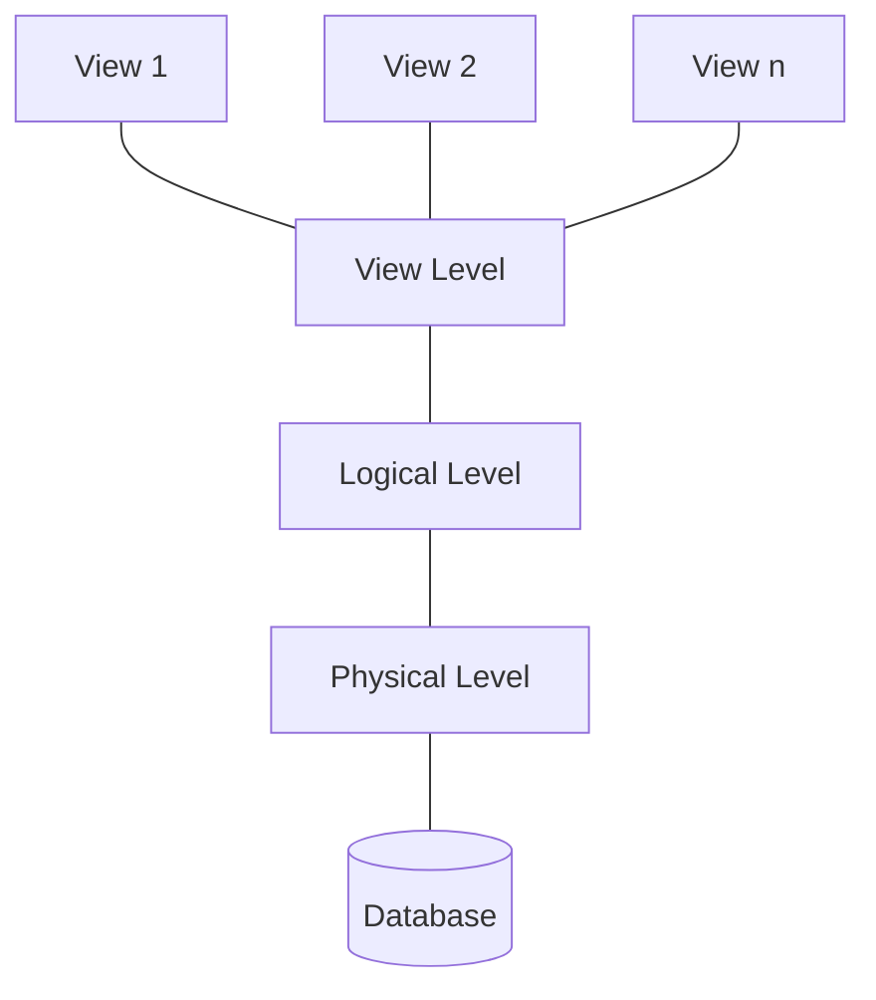
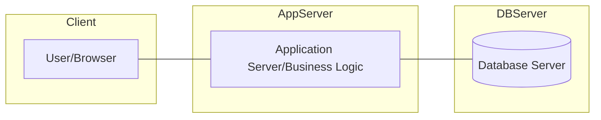

# Week 1: Introduction to Database Management Systems (DBMS)

## Learning Checklist
- [ ] Understand the fundamental definition and goals of a DBMS.
- [ ] Contrast DBMS-based data management with traditional File-Processing systems.
- [ ] Identify the 4 ACID properties of transactions.
- [ ] Distinguish between Physical, Logical, and View levels of abstraction.
- [ ] Explain the difference between Database Schema and Database Instance.
- [ ] Familiarize with different Data Models (Relational, E-R, Semi-structured).
- [ ] Map the internal components of a Database Engine.
- [ ] Compare 2-tier and 3-tier application architectures.

---

## 1. Defining the DBMS
A **Database Management System (DBMS)** is a collection of interrelated data and a set of programs to access that data. The primary goal is to provide an environment that is both **convenient** and **efficient** for retrieving and storing information.

### Scope of Applications
Databases are used to manage collections of data that are highly valuable, relatively large, and accessed by multiple users concurrently. Key sectors include:
*   **Banking & Finance:** Transactions, credit cards, and instrument holdings.
*   **Universities:** Student records, course registrations, and grading.
*   **Web Services:** Social media connections, online retailers (order tracking), and targeted advertisements.
*   **Manufacturing:** Supply chain management and inventory tracking.

---

## 2. Why DBMS? (The File-System Critique)
In the early days, applications were built directly on top of file systems. This approach had significant technical drawbacks that a DBMS is specifically designed to solve.

### 2.1 Comparison Table: File Systems vs. DBMS
| Feature | File Handling (e.g., via Python/Files) | DBMS |
| :--- | :--- | :--- |
| **Data Redundancy** | High; information is duplicated in different files/formats. | Minimized; unified storage. |
| **Consistency** | Difficult to ensure; updates may not reflect in all file copies. | In-built mechanisms ensure all copies or references remain sane. |
| **Atomicity** | Hard to implement; failures leave data in partial update states. | Transaction manager ensures "all-or-nothing" execution. |
| **Concurrency** | Limited; uncontrolled concurrent access leads to inconsistencies. | Concurrency-control manager handles simultaneous updates. |
| **Security** | Difficult to implement granular permissions. | User-specific access control at the database level. |
| **Persistence** | Must be manually coded to update from memory to disk. | Automatically ensured via system-induced mechanisms. |

> [!IMPORTANT]
> **Atomicity Example:** In a funds transfer, if the system crashes after debiting Account A but before crediting Account B, the money vanishes. A DBMS prevents this by rolling back the partial update.

---

## 3. View of Data & Abstraction
The DBMS hides the complexity of data structures through levels of abstraction, allowing different users to see only what they need.

### 3.1 Levels of Abstraction
1.  **Physical Level:** The lowest level; describes *how* data are actually stored (e.g., as blocks of bytes, indices).
2.  **Logical Level:** Describes *what* data are stored and what relationships exist (e.g., an instructor record is defined by ID, name, and salary).
3.  **View Level:** The highest level; application programs hide details of data types and may hide sensitive info (like salary) for security.

### 3.2 Schema vs. Instance
*   **Schema:** The logical design of the database (analogous to variable declarations in a program).
    *   **Physical Schema:** Describes design at the physical level.
    *   **Logical Schema:** Describes design at the logical level; the most important for application developers.
*   **Instance:** The actual content of the database at a specific moment in time (analogous to the current value of a variable).

---

## 4. Data Models
A data model is a collection of conceptual tools for describing data and its constraints.

*   **Relational Model:** Data represented in tables (relations). This is the foundation of most modern DBMS applications.
*   **Entity-Relationship (E-R) Model:** Uses objects (entities) and their associations. Primarily used for database design.
*   **Semi-structured Model:** Allows individual data items of the same type to have different sets of attributes (e.g., JSON, XML).
*   **Object-Based Model:** Extends the relational model with encapsulation, methods, and object identity.

---

## 5. Database Languages
SQL serves as the primary language for both defining and manipulating data.

### 5.1 Data-Definition Language (DDL)
Used to specify the database schema and integrity constraints.
*   **Data Dictionary:** Stores "metadata" (data about data) generated by the DDL compiler.
*   **Constraints:** Includes Domain Constraints (permitted values), Referential Integrity (foreign keys), and Authorization.

### 5.2 Data-Manipulation Language (DML)
Also known as a **Query Language**, used for accessing/manipulating data.
*   **Procedural DML:** User specifies *what* is needed and *how* to get it.
*   **Declarative (Nonprocedural) DML:** User specifies *what* is needed *without* the "how" (e.g., SQL).

> [!NOTE]
> SQL is **not** Turing-machine equivalent; it cannot solve every mathematical problem a general-purpose language like C or Java can.

---

## 6. Database Engine Internals
A database system is partitioned into modules that handle specific responsibilities.

### 6.1 Storage Manager
The interface between low-level data on disk and application queries.
*   **Authorization/Integrity Manager:** Checks constraints and user permissions.
*   **Transaction Manager:** Ensures the database remains consistent despite failures.
*   **Buffer Manager:** Fetches data from disk into main memory; critical for handling data larger than RAM.

### 6.2 Query Processor
Translates DML statements into an evaluation plan.
*   **DML Compiler:** Performs **Query Optimization** to find the lowest-cost plan among alternatives.
*   **Evaluation Engine:** Executes the low-level instructions.

---

## 7. Application Architecture
Applications are generally partitioned into layers to manage complexity.

*   **Two-tier Architecture:** The application resides on the client machine and directly invokes database functionality on the server.
*   **Three-tier Architecture:** The client (front end) communicates with an **Application Server**, which in turn communicates with the database (back end).
    *   This is standard for modern web and mobile apps as it provides better security and performance.

---

## Technical Glossary

| Term | Definition |
| :--- | :--- |
| **ACID** | Atomicity, Consistency, Isolation, Durability; properties required for reliable transaction processing. |
| **Metadata** | Data about data stored in the data dictionary (e.g., table schemas, constraints). |
| **Physical Data Independence** | The ability to modify the physical schema without changing the logical schema or application programs. |
| **Dirty Write** | Disallowed write to a data item that has been updated by an uncommitted transaction. |
| **WYSIWYG** | Heuristic term for "What You See Is What You Get"; in DBMS, this refers to views providing a personalized virtual relation. |
| **WAL Rule** | Write-Ahead Logging; rule stating that log records must be output to stable storage before the corresponding data block is written to disk. |
