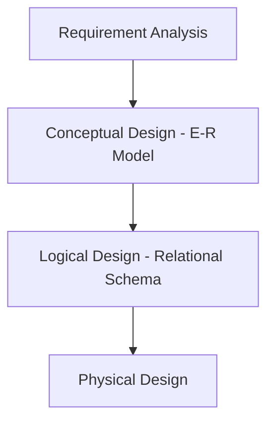

# Week 1: Introduction to Database Management Systems (DBMS)

## 1. Course Overview and the Importance of DBMS 

Database Management Systems are essential for modern applications, providing a structured and efficient way to store, retrieve, and manage data.

### 1.1 Course Roles

Working with databases involves several distinct professional roles:

* 
**Database Administrator (DBA):** Responsible for the overall management and security of the system.

* 
**Database Designer:** Designs the logical structure (schema) of the database.

* 
**Application Programmer:** Writes software that interacts with the database.

---

## 2. Why DBMS? Historical Context & Evolution

The management of records is a fundamental human need, evolving from physical storage to sophisticated digital architectures.

### 2.1 Timeline of Data Management

1. 
**1960s:** Early hierarchical and network models (e.g., IBM's IMS).

2. 
**1970s:** E.F. Codd introduces the **Relational Model**, leading to the birth of SQL and systems like System R and Ingres.

3. 
**1980s:** Commercialization of RDBMS (Oracle, DB2) and research into Object-Oriented databases.

4. 
**1990s:** Shift toward web-based databases, Data Warehousing, and ERP systems.

5. 
**2000s:** Integration of XML and XQuery.

6. 
**2010s:** Rise of **NoSQL**, Big Data, and In-Memory systems.

### 2.2 Generations of DBMS

* 
**1st Gen:** Proprietary, disk-based systems.

* 
**2nd Gen:** Relational and Object-Oriented, disk-based.

* 
**3rd Gen:** Columnar, RAM-based, and Non-schematic (NoSQL) systems.

---

## 3. File Systems vs. DBMS

Using a general-purpose programming language (like Python) to manage data in files has significant drawbacks compared to a dedicated DBMS.

### 3.1 Limitations of File-Based Systems

* 
**Data Redundancy and Inconsistency:** Information may be duplicated in different files, leading to conflicting data.

* 
**Difficulty in Accessing Data:** Requires writing new programs for every unique query.

* 
**Data Isolation:** Data is scattered in multiple files and formats.

* 
**Integrity Problems:** Hard to enforce constraints (e.g., salary > 0) across multiple programs.

* 
**Atomicity Problems:** A failure during a multi-step transaction (like a bank transfer) can leave data in an inconsistent state.

* 
**Concurrent-Access Anomalies:** Multiple users accessing the same data simultaneously can cause errors.

* 
**Security Problems:** Difficult to provide granular access control.

### 3.2 Parameterized Comparison

File Systems vs. DBMS

| Feature | File System | Database Management System (DBMS) |
| --- | --- | --- |
| **Cost** | **Low:** Utilizes existing OS defaults and requires no extra licenses. | **High:** Costs involve specialized software, high-end hardware, and skilled personnel. |
| **Complexity** | **Simple:** Easy to set up; follows basic hierarchical folder/file structures. | **Inherently Complex:** Requires rigorous design, maintenance, and administrative effort. |
| **Integrity** | **Difficult to maintain:** Hard to enforce data constraints; prone to redundancy and inconsistency. | **Built-in mechanisms:** Uses constraints (keys, types) and normalization to ensure data accuracy. |
| **Concurrency** | **Limited/Manual:** Often leads to "lost updates" if two users edit the same file simultaneously. | **Automated/Sophisticated:** Uses locking and transaction management for seamless multi-user access. |
| **Security** | **Basic:** Relying on OS-level folder permissions; lacks granular "row-level" control. | **Granular & Highly Secure:** Allows specific permissions for different users on specific data subsets. |

---

## 4. Levels of Abstraction and Data Modeling 
A major goal of a DBMS is to hide complexity from users through abstraction.

### 4.1 The Three Levels of Abstraction

1. 
**Physical Level:** Describes *how* data is actually stored (e.g., bit patterns on disk).

2. 
**Logical Level:** Describes *what* data is stored and the relationships between them (e.g., table structures).

3. 
**View Level:** Describes only a part of the entire database relevant to a specific user (e.g., a student view vs. a registrar view).

### 4.2 Schema vs. Instance

* 
**Schema:** The logical structure of the database (similar to a class/type in programming).

* 
**Instance:** The actual data contained in the database at a specific moment (similar to an object/variable value).

### 4.3 Data Models

A data model is a collection of conceptual tools for describing data.

* 
**Relational Model:** Data represented as tables.

* 
**Entity-Relationship (E-R) Model:** Used for database design.

* 
**Object-Based Model:** Extends the relational model with object-oriented features.

* 
**Semi-structured Model:** Used for XML/JSON data.

---

## 5. Database Languages and Design (Module 04 & 05)

### 5.1 SQL: DDL and DML

* 
**Data Definition Language (DDL):** Used to define the database schema and storage structures.

* 
**Data Manipulation Language (DML):** Used for accessing and manipulating data (querying, inserting, deleting, updating).

### 5.2 The Design Process

---

## 6. Database Engine and Architecture 

A DBMS is partitioned into modules that handle specific responsibilities.

### 6.1 Major Components

1. 
**Storage Manager:** Interfaces between low-level data on disk and application programs.

* 
*Authorization/Integrity Manager:* Checks constraints and permissions.

* 
*Transaction Manager:* Ensures ACID properties.

* 
*Buffer Manager:* Manages data movement between disk and main memory.

2. **Query Processor:**
* 
*Parser/Translator:* Converts SQL into internal instructions.

* 
*Optimizer:* Finds the most efficient way to execute a query.

* 
*Execution Engine:* Runs the instructions.

### 6.2 System Architecture

* 
**Centralized:** One single system.

* **Client-Server:**
* 
**2-Tier:** Application resides on the client and calls database functions on the server.

* 
**3-Tier:** Client communicates with an application server, which in turn communicates with the database system.
