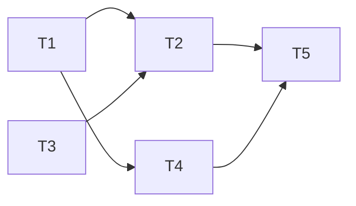

# 10.1 Transactions/1

## **Recap**
*   Need for indexing database tables.
*   Understood the ordered indexes.
*   Recap of Balanced BST for optimal in-memory search data structures.
*   Issues of external search data structures for persistent data.
*   Explored 2-3-4 Tree as a precursor to $B/B^+$-Tree.
*   Understood the $B^+$ Tree and B Tree for Index files and data files.
*   Explored Static and Dynamic Hashing.
*   Compared Ordered Indexing and Hashing.
*   Studied the use of Bitmap Indices.
*   Learnt to create indexes in SQL.
*   Learnt a set of Ground Rules for Indexing.

## **Objectives**
*   To understand the concept of transaction doing a task in a database and its state.
*   To explore issues in concurrent execution of transactions.

## **1. Transaction Concept**

### **1.1. Definition**
*   A transaction is a unit of program execution that accesses and, possibly updates, various data items.
*   It consists of a couple of one or more sequence of instructions.
*   These instructions can access (read), update (write), and perform typical programming language computations in between.

### **1.2. Example Transaction**
A sample transaction to transfer \$50 from account A to account B:
1.  `read(A)`
2.  `A := A - 50`
3.  `write(A)`
4.  `read(B)`
5.  `B := B + 50`
6.  `write(B)`.

*Explanation:* The system first reads the current balance of A and subtracts 50 (assuming enough balance is available). Account A is debited, and the new value is written back. Then, B is read, the amount is added to its balance, and the new value is written back to credit account B.

### **1.3. Major Issues in Transactions**
1.  **Failures:** Various kinds such as hardware failures, software errors, and system crashes can occur at any point during execution.
2.  **Concurrency:** How to handle multiple transactions working with the same data at the same time to ensure better system performance with necessary restrictions.

---

## **2. Required Properties of a Transaction: ACID**

### **2.1. Atomicity**
*   **Requirement:** "All or Nothing".
*   If a transaction fails at any step (e.g., after step 3 but before step 6 in the \$50 transfer), money will be "lost," leading to an inconsistent database state.
*   The system must ensure that updates of a partially executed transaction are not reflected in the database.
*   Atomicity must be guaranteed in all situations, including power failures and error conditions.

### **2.2. Consistency**
*   **Requirement:** Guarantees committed transaction state.
*   Execution of a transaction in isolation (with no other concurrent transactions) must preserve the consistency of the database.
*   Example: $A+B$ must be unchanged by the execution of the transfer transaction.
*   Consistency constraints include explicitly specified integrity constraints (Primary/Foreign Keys) and implicit constraints (e.g., assets minus liabilities must equal cash-in-hand).
*   A transaction starting its execution must see a consistent database; it may be temporarily inconsistent during execution but must be consistent upon successful termination.

### **2.3. Isolation**
*   **Requirement:** Transactions are independent.
*   Ensures that concurrent execution of transactions leaves the database in the same state as if they were executed sequentially.
*   If a transaction $T_2$ is allowed to access a partially updated database (e.g., between steps 3 and 6 of $T_1$), it will see an inconsistent state where the sum $A+B$ is less than it should be.

### **2.4. Durability**
*   **Requirement:** Committed data is never lost.
*   Once a user is notified that the transaction has completed, updates must persist even in the face of software or hardware failures.
*   This typically means completed transactions are recorded in non-volatile memory.

---

## **3. Transaction States**

Every transaction exists in one of the following states, similar to process states in an Operating System:

*   **Active:** The initial state; the transaction stays here while it is executing.
*   **Partially Committed:** After the final statement has been executed, but before it is verified that updates can be made permanent.
*   **Failed:** After the discovery that normal execution can no longer proceed.
*   **Aborted:** After the transaction has been rolled back and the database restored to its prior state. Two options exist after abortion:
    1.  **Restart:** Only if there was no internal logical error (e.g., hardware/software error).
    2.  **Kill:** Due to internal logical errors or bad input.
*   **Committed:** After successful completion and writing updates to permanent store.
*   **Terminated:** The final state after the transaction has been either committed or killed.

---

## **4. Concurrent Executions**

### **4.1. Advantages**
*   **Increased Processor and Disk Utilization:** One transaction can use the CPU while another reads/writes to disk, leading to better throughput.
*   **Reduced Average Response Time:** Short transactions do not have to wait behind long-running ones.

### **4.2. Concurrency Control Schemes**
*   These are mechanisms used to achieve **Isolation**.
*   They control interaction among concurrent transactions to prevent them from destroying database consistency.

---

## **5. Schedules**

### **5.1. Definition**
*   A schedule is a sequence of instructions specifying the chronological order in which instructions of concurrent transactions are executed.
*   It must consist of all instructions of those transactions and preserve the relative order of instructions within each individual transaction.
*   A successfully completed transaction ends with a `commit` instruction; a failed one ends with `abort`.

### **5.2. Serial Schedules**
*   Each serial schedule consists of a sequence of instructions where instructions belonging to one single transaction appear together.
*   For a set of $n$ transactions, there are $n!$ (n factorial) different valid serial schedules.

### **5.3. Schedule Examples and Consistency**
Consider $T_1$ (transfer \$50 from A to B) and $T_2$ (transfer 10% from A to B). Assume initial values: $A = 100, B = 200$ (Sum = 300).

*   **Schedule 1 (Serial: $T_1$ then $T_2$):**
    *   Final: $A = 45, B = 255$. Consistent sum = 300.
*   **Schedule 2 (Serial: $T_2$ then $T_1$):**
    *   Final: $A = 40, B = 260$. Consistent sum = 300.
*   **Schedule 3 (Concurrent/Serializable):**
    *   Instructions are interleaved but result in a consistent state equivalent to Schedule 1.
    *   Preserves the sum $A+B = 300$.
*   **Schedule 4 (Concurrent/Not Serializable):**
    *   *Problem:* The read/write operations are intermixed such that updates are overwritten.
    *   Walkthrough: $T_1$ reads $A(100)$ and computes $50$ locally. $T_2$ reads $A(100)$, computes interest $(10)$, and writes $A(90)$. Then $T_1$ writes its local $A(50)$, overwriting $T_2$'s update. $T_1$ reads $B(200)$, writes $B(250)$, and commits. $T_2$ adds its local temp $(10)$ to $B(200)$ and writes $B(210)$.
    *   Final: $A = 50, B = 210$. Inconsistent sum = 260 (\$40 lost).

---

# 10.2 Transactions/2: Serializability

## **Objectives**
*   To understand the issues that arise when two or more transactions work concurrently.
*   To introduce the notions of Serializability that ensure schedules for transactions that may run in concurrent fashion but still guarantee and serial behavior.
*   To analyze the conditions, called conflicts, that need to be honored to attain Serializable schedules.

## **1. Serializability**

### **1.1. Basic Assumptions and Definition**
*   **Assumption:** Each transaction preserves database consistency.
*   Thus, serial execution of a set of transactions preserves database consistency.
*   A (possibly concurrent) schedule is **serializable** if it is equivalent to a serial schedule.
*   Different forms of schedule equivalence give rise to the notions of:
    *   **Conflict Serializability**.
    *   **View Serializability**.

### **1.2. Simplified View of Transactions**
*   We ignore operations other than **read** and **write** instructions.
*   Other operations happen in memory (are temporary in nature) and (mostly) do not affect the state of the database.
*   This is a simplifying assumption for analysis.
*   We assume that transactions may perform arbitrary computations on data in local buffers in between reads and writes.
*   Our simplified schedules consist of only read and write instructions.

### **1.3. Conflicting Instructions**
Let $I_i$ and $I_j$ be two instructions from transactions $T_i$ and $T_j$ respectively $(i \neq j)$. Instructions $I_i$ and $I_j$ conflict if and only if there exists some item $Q$ accessed by both $I_i$ and $I_j$, and at least one of these instructions writes to $Q$.

Since we are dealing with only read and write instructions, there are four cases that we need to consider:
1.  **$I_i = read(Q), I_j = read(Q)$**: The order of $I_i$ and $I_j$ does not matter, since the same value of $Q$ is read by $T_i$ and $T_j$, regardless of the order. They **do not conflict**.
2.  **$I_i = read(Q), I_j = write(Q)$**: If $I_i$ comes before $I_j$, then $T_i$ does not read the value of $Q$ that is written by $T_j$ in instruction $J$. If $I_j$ comes before $I_i$, then $T_i$ reads the value of $Q$ that is written by $T_j$. Thus, the order of $I_i$ and $I_j$ matters. They **conflict**.
3.  **$I_i = write(Q), I_j = read(Q)$**: The order of $I_i$ and $I_j$ matters for reasons similar to those of the previous case. They **conflict**.
4.  **$I_i = write(Q), I_j = write(Q)$**: Since both instructions are write operations, the order of these instructions does not affect either $T_i$ or $T_j$. However, the value obtained by the next $read(Q)$ instruction is affected, since the result of only the latter of the two write instructions is preserved in the database. If there is no other $write(Q)$ instruction after $I_i$ and $I_j$, then the order directly affects the final value of $Q$. They **conflict**.

> [!NOTE]
> A conflict between $I_i$ and $I_j$ forces a (logical) temporal order. If $I_i$ and $I_j$ are consecutive in a schedule and they do not conflict, then the results of the schedule remain the same even if they had been interchanged (swapped) in the schedule.

---

## **2. Conflict Serializability**

### **2.1. Conflict Equivalence**
*   If a schedule $S$ can be transformed into a schedule $S'$ by a series of swaps of non-conflicting instructions, we say that $S$ and $S'$ are **conflict equivalent**.

### **2.2. Conflict Serializability Definition**
*   We say that a schedule $S$ is **conflict serializable** if it is conflict equivalent to a serial schedule.

### **2.3. Example: Serializable Schedule (Schedule 3)**
Schedule 3 can be transformed into Schedule 6 (a serial schedule where $T_2$ follows $T_1$) by a series of swaps of non-conflicting instructions:
1.  Swap $T_1.read(B)$ and $T_2.write(A)$.
2.  Swap $T_1.read(B)$ and $T_2.read(A)$.
3.  Swap $T_1.write(B)$ and $T_2.write(A)$.
4.  Swap $T_1.write(B)$ and $T_2.read(A)$.

These swaps do not conflict as they work with different items ($A$ or $B$) in different transactions.

### **2.4. Example: Non-Conflict Serializable (Schedule 7)**
Consider Schedule 7:
| $T_3$ | $T_4$ |
| :--- | :--- |
| $read(Q)$ | |
| | $write(Q)$ |
| $write(Q)$ | |

We are unable to swap instructions in the above schedule to obtain either the serial schedule $<T_3, T_4>$, or the serial schedule $<T_4, T_3>$ because both operations are on $Q$ and one is a write.

### **2.5. Example: Bad Schedule (Not Serializable)**
Consider two transactions:
*   **Transaction 1:** $r_1(A), w_1(A)$ (Withdraw \$100 from $A$).
*   **Transaction 2:** $r_2(A), w_2(A), r_2(B), w_2(B)$ (Credit 0.5% interest to all accounts).
*   **Initial:** $A = 200, B = 100$.
*   **Schedule S:** $r_1(A), r_2(A), w_1(A), w_2(A), r_2(B), w_2(B)$.
    *   $r_1(A)$ reads 200.
    *   $r_2(A)$ reads 200.
    *   $w_1(A)$ writes 100 (200 - 100).
    *   $w_2(A)$ writes 201 (200 * 1.005).
*   **Result:** Withdrawal of \$100 is lost; final $A = 201$. This is a **bad schedule**.

---

## **3. Testing for Conflict Serializability**

### **3.1. Precedence Graph**
To determine conflict serializability, we construct a directed graph called a **precedence graph** $G = (V, E)$.
*   **Vertices ($V$):** The set of all transactions participating in the schedule.
*   **Edges ($E$):** We draw an arc from $T_i$ to $T_j$ if the two transactions conflict, and $T_i$ accessed the data item on which the conflict arose earlier.

**Conditions for drawing an edge $T_i \rightarrow T_j$:**
1.  $T_i$ executes $write(Q)$ and $T_j$ later executes $read(Q)$.
2.  $T_i$ executes $read(Q)$ and $T_j$ later executes $write(Q)$.
3.  $T_i$ executes $write(Q)$ and $T_j$ later executes $write(Q)$.

### **3.2. Serializability Test**
*   A schedule is conflict serializable if and only if its precedence graph is **acyclic**.
*   If the graph contains no cycles, then the schedule $S$ is conflict serializable.
*   **Serializability Order:** A serializability order of the transactions can be obtained by a **topological sorting** of the graph (a linear order consistent with the partial order of the graph).
*   There are, in general, several possible linear orders obtained through topological sort.

### **3.3. Algorithm Complexity**
*   Cycle-detection algorithms take $O(n^2)$ time where $n$ is the number of vertices.
*   Better algorithms take $O(n + e)$ time where $e$ is the number of edges.

### **3.4. Example: Precedence Graph Construction**
**Schedule:** $w_1(A), r_2(A), w_1(B), w_3(C), r_2(C), r_4(B), w_2(D), w_4(E), r_5(D), w_5(E)$.
*   $w_1(A)$ followed by $r_2(A) \Rightarrow T_1 \rightarrow T_2$.
*   $w_1(B)$ followed by $r_4(B) \Rightarrow T_1 \rightarrow T_4$.
*   $w_3(C)$ followed by $r_2(C) \Rightarrow T_3 \rightarrow T_2$.
*   $w_2(D)$ followed by $r_5(D) \Rightarrow T_2 \rightarrow T_5$.
*   $w_4(E)$ followed by $w_5(E) \Rightarrow T_4 \rightarrow T_5$.

*Graph is acyclic; therefore, the schedule is conflict serializable.*

---

## **4. View Serializability (Brief Intro)**
*   There is another form of equivalence that is less stringent than conflict equivalence, called **view equivalence**.
*   A schedule $S$ is **view serializable** if it is view equivalent to a serial schedule.
*   Every conflict serializable schedule is also view serializable.
*   View serializable schedules that are not conflict serializable always involve **blind writes** (performing a $write(Q)$ without a preceding $read(Q)$).

---

# 10.3 Transactions/3: Recoverability

## **Objectives**
*   What happens if system fails while a transaction is in execution? Can a consistent state be reached for the database? Recoverability attempts to answer issues in state and transaction recovery in the face of system failures.
*   Conflict serializability is a crisp concept for concurrent execution that guarantees ACID properties and has a simple detection algorithm. Yet only few schedules are Conflict serializable in practice. There is a need to explore – View Serializability – a weaker system for better concurrency.

## **1. Recovery**

### **1.1 What is Recovery?**
*   Serializability helps to ensure Isolation and Consistency of a schedule.
*   Yet, the Atomicity and Consistency may be compromised in the face of system failures.
*   Consider a schedule comprising a single transaction (obviously serial):
    1.  `read(A)`
    2.  `A := A - 50`
    3.  `write(A)`
    4.  `read(B)`
    5.  `B := B + 50`
    6.  `write(B)`
    7.  `commit` // Make the changes permanent; show the results to the user.
*   If the system fails after Step 3 and before Step 6, it leads to an inconsistent state.
*   The system needs to rollback the update of A; this is known as **Recovery**.

### **1.2 Recoverable Schedules**
*   **Definition:** If a transaction $T_j$ reads a data item previously written by a transaction $T_i$, then the commit operation of $T_i$ must appear before the commit operation of $T_j$.
*   Database must ensure that schedules are recoverable to prevent transactions from reading and showing inconsistent states to the user.

### **1.3 Cascading Rollbacks**
*   **Cascading rollback:** A single transaction failure leads to a series of transaction rollbacks.
*   If $T_{10}$ fails in a schedule where $T_{11}$ read from $T_{10}$, and $T_{12}$ read from $T_{11}$, then $T_{11}$ and $T_{12}$ must also be rolled back.
*   This leads to the undoing of a significant amount of work.

### **1.4 Cascadeless Schedules**
*   **Definition:** For each pair of transactions $T_i$ and $T_j$ such that $T_j$ reads a data item previously written by $T_i$, the commit operation of $T_i$ appears before the read operation of $T_j$.
*   Every cascadeless schedule is also recoverable.
*   It is desirable to restrict schedules to those that are cascadeless.

### **1.5 Recovery Examples**

| Schedule Type | Scenario | Outcome |
| :--- | :--- | :--- |
| **Irrecoverable** | $T_2$ commits after reading $T_1$'s write, but $T_1$ fails later. | Computation of $T_1$ is lost; database is inconsistent. |
| **Recoverable (Cascading)** | $T_2$ reads $T_1$'s write and has not committed when $T_1$ fails. | Rollback is possible, but $T_2$ must also be rolled back. |
| **Recoverable (Non-cascading)** | $T_1$ commits before $T_2$ reads the value. | Rollback is possible without cascading wherever failure occurs. |

---

## **2. Transaction Definition in SQL**

### **2.1 Basic Constructs**
*   In SQL, a transaction begins implicitly.
*   A transaction ends by:
    *   `COMMIT WORK`: Commits the current transaction and begins a new one.
    *   `ROLLBACK WORK`: Causes the current transaction to abort.
*   By default, in almost all database systems, every SQL statement also commits implicitly if it executes successfully (AutoCommit).

### **2.2 Transaction Control Language (TCL)**
Transactional control commands are used only with DML commands (`INSERT`, `UPDATE`, `DELETE`).

*   **COMMIT**: Saves all changes invoked by a transaction since the last `COMMIT` or `ROLLBACK`.
*   **ROLLBACK**: Undoes transactions that have not already been saved to the database.
*   **SAVEPOINT**: Creates a point in a transaction to which you can roll back without undoing the entire transaction.
    *   *Syntax:* `SAVEPOINT SAVEPOINT_NAME;`
    *   *Rollback Syntax:* `ROLLBACK TO SAVEPOINT_NAME;`
*   **RELEASE SAVEPOINT**: Removes a created `SAVEPOINT`. Once released, you cannot roll back to it.
*   **SET TRANSACTION**: Used to specify characteristics like `READ WRITE` or `READ ONLY`.

---

## **3. View Serializability**

### **3.1 View Equivalence Conditions**
Two schedules $S$ and $S'$ are view equivalent if three conditions are met for each data item $Q$:
1.  **Initial Read:** If in schedule $S$, transaction $T_i$ reads the initial value of $Q$, then in schedule $S'$ also transaction $T_i$ must read the initial value of $Q$.
2.  **Write-Read Pair:** If in schedule $S$ transaction $T_j$ reads a value produced by $T_i$, then in $S'$ also $T_j$ must read the value produced by the same `write(Q)` of $T_i$.
3.  **Final Write:** The transaction (if any) that performs the final `write(Q)` operation in schedule $S$ must also perform the final `write(Q)` operation in schedule $S'$.

### **3.2 Properties and Blind Writes**
*   **Definition:** A schedule $S$ is view serializable if it is view equivalent to a serial schedule.
*   Every conflict serializable schedule is also view serializable.
*   **Blind Writes:** Performing a `write(Q)` without having performed a `read(Q)`.
*   Every view serializable schedule that is not conflict serializable contains blind writes.

### **3.3 Test for View Serializability**
*   The test for view serializability is **NP-complete**.
*   Practical tests involve comparing the concurrent schedule against all possible $n!$ serial schedules to check if any satisfy the three view equivalence conditions.

---

## **4. Complex Notions of Serializability**
*   Some schedules produce the same outcome as a serial schedule but are neither conflict equivalent nor view equivalent.
*   Determining such equivalence requires analysis of operations other than just `read` and `write`, such as the mathematical properties of addition and subtraction.

---

# 10.4 Concurrency Control/1

## **Objectives**
*   Concurrency Control through the design of a serializable schedule is difficult in general. Hence we take a look into the locking mechanism and **Lock-Based Protocols**.
*   We need to understand how locks may be implemented.

## **1. Concurrency Control**

### **1.1. Core Requirements**
A database must provide a mechanism that will ensure that all possible schedules are both:
1.  **Conflict serializable**.
2.  **Recoverable** and, preferably, **Cascadeless**.

### **1.2. The Design Goal**
*   A policy in which only one transaction can execute at a time generates serial schedules but provides a poor degree of concurrency.
*   Concurrency-control schemes tradeoff between the amount of concurrency they allow and the amount of overhead that they incur.
*   Testing a schedule for serializability after it has executed is too late. The goal is to develop protocols that **assure** serializability dynamically during execution.

---

## **2. Lock-Based Protocols**

### **2.1. Basic Mechanism**
*   Isolation can be ensured by requiring that data items be accessed in a mutually exclusive manner: while one transaction is accessing a data item, no other transaction can modify that data item.
*   A **lock** is a mechanism used to implement this requirement, allowing a transaction to access a data item only if it is currently holding the lock on that item.

### **2.2. Lock Modes**
Data items can be locked in two modes:
1.  **Exclusive (X) mode**: The data item can be both read as well as written. It is requested using the `lock-X` instruction.
2.  **Shared (S) mode**: The data item can only be read. It is requested using the `lock-S` instruction.

### **2.3. Lock-Compatibility Matrix**
A lock-compatibility matrix determines if a data item can be locked by two transactions at the same time.

| State of the lock | Shared | Exclusive |
| :--- | :--- | :--- |
| **Shared** | Yes | No |
| **Exclusive** | No | No |

> [!NOTE]
> A transaction may be granted a lock if the requested mode is compatible with locks already held by other transactions. Multiple transactions can hold shared locks on an item, but if any transaction holds an exclusive lock, no other transaction may hold any lock on that item.

---

## **3. Lock Operations and Lifecycle**

*   **Requesting/Granting**: Lock requests are made to the concurrency-control manager. The transaction can only proceed after the request is granted.
*   **Waiting**: If a lock cannot be granted, the requesting transaction is made to wait until all incompatible locks held by others are released.
*   **Holding**: A transaction must hold a lock as long as it accesses the item.
*   **Unlocking**: A transaction can unlock a data item $Q$ using the `unlock(Q)` instruction. However, it is not always desirable to unlock an item immediately after its final access, as serializability may not be ensured.

---

## **4. Example: Fund Transfer and Total Balance**

Consider two transactions on accounts $A$ and $B$ (Initial: $A=100$, $B=200$; Sum = 300):
*   **$T_1$**: Transfers \$50 from account $B$ to account $A$.
*   **$T_2$**: Displays the total amount $A+B$.

### **4.1. Schedule 1 (Bad Concurrent Schedule)**
If $T_1$ unlocks data item $B$ too early, $T_2$ may see an inconsistent state.

*   **Result**: $T_2$ displays \$250, which is incorrect as \$50 is missing from the total.

### **4.2. Schedule with Delayed Unlocking (Good)**
Unlocking is delayed to the end of the transaction (defining $T_3$ and $T_4$).

*   **Result**: $T_4$ correctly displays \$300.

### **4.3. Deadlocks**
Delayed unlocking can lead to a **deadlock**, where every transaction in a set is waiting for another in the set.

> [!IMPORTANT]
> Deadlocks are a "necessary evil" of locking to avoid inconsistent states. They are handled by rolling back one of the transactions, which is preferable to leaving the database in a state that could lead to real-world problems.

---

## **5. Two-Phase Locking (2PL) Protocol**

This protocol ensures conflict-serializable schedules by dividing the lifecycle into two phases:
1.  **Phase 1: Growing Phase**:
    *   A transaction may obtain locks.
    *   A transaction may **not** release any locks.
2.  **Phase 2: Shrinking Phase**:
    *   A transaction may release locks.
    *   A transaction may **not** obtain any new locks.

*   **Lock Point**: The point in time where a transaction acquires its final lock (the end of the growing phase). Transactions can be serialized according to their lock points.

### **5.1. Lock Conversions**
A refinement that allows more concurrency by permitting:
*   **Growing Phase**:
    *   Acquire `lock-S` or `lock-X`.
    *   **Upgrade**: Convert `lock-S` to `lock-X`.
*   **Shrinking Phase**:
    *   Release `lock-S` or `lock-X`.
    *   **Downgrade**: Convert `lock-X` to `lock-S`.

---

## **6. Automatic Acquisition of Locks**

To relieve programmers of inserting explicit lock/unlock calls, the system processes `read(D)` and `write(D)` instructions automatically:

*   **`read(D)`**:
    1.  If $T_i$ has a lock on $D$, execute `read(D)`.
    2.  Else, wait until no other transaction has a `lock-X` on $D$.
    3.  Grant $T_i$ a `lock-S` on $D$ and execute `read(D)`.
*   **`write(D)`**:
    1.  If $T_i$ has a `lock-X` on $D$, execute `write(D)`.
    2.  Else, wait until no other transaction has **any** lock on $D$.
    3.  If $T_i$ has a `lock-S`, **upgrade** it to `lock-X`.
    4.  Else, grant $T_i$ a `lock-X` and execute `write(D)`.

---

## **7. Isolation Issues: Starvation and Cascading**

### **7.1. Starvation**
Occurs if the concurrency control manager is badly designed. For example, a transaction waits for an X-lock while a sequence of others are granted S-locks on the same item, or a transaction is repeatedly picked as a victim for deadlock rollback.

### **7.2. Cascading Rollback**
The failure of one transaction leads to a series of other rollbacks.

### **7.3. Strict and Rigorous 2PL**
*   **Strict Two-Phase Locking**: A transaction must hold all its **exclusive** locks until it commits/aborts to avoid cascading rollbacks.
*   **Rigorous Two-Phase Locking**: All locks (shared and exclusive) are held until commit/abort. Transactions are serialized in the order in which they commit.

---

## **8. Implementation of Locking**

### **8.1. Lock Manager**
Implemented as a separate process. Transactions send lock/unlock requests and wait for responses (grant or rollback).

### **8.2. Lock Table**
An in-memory hash table indexed on the data item name.

*   New requests are added to the end of a queue for the data item.
*   If a transaction aborts, all its waiting and granted requests are deleted.
