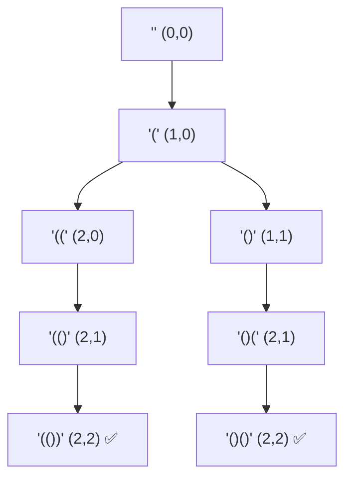

# 22. Generate Parentheses 🟡

## Intuition

Imagine building a structure using pairs of opening `(` and closing `)` brackets. Every time you open a bracket, you must eventually close it.

Crucially, **you cannot close a bracket before opening one**.

* **Valid:** `(()())` : Every closing bracket has a matching open bracket before it.
* **Invalid:** `())(` : The third character closes a bracket that was never opened.

Instead of generating all possible strings of length $2n$ and checking their validity afterwards, we build the string **one character at a time** and only make choices that preserve validity.

## Approach

We use recursive backtracking to explore choices. We maintain three pieces of state:

1. `current`: The string built so far.
2. `open_count`: Number of opening brackets used.
3. `close_count`: Number of closing brackets used.

### Decision Rules

> 1. **Add `(**`: Allowed whenever `open_count < n`.
> 2. **Add `)**`: Allowed only when `close_count < open_count` (ensures balanced pairs).
> 3. **Base Case**: When `len(current) == 2 * n`, all brackets have been placed. Append `current` to the output.
> 
> 

## Example Walkthrough (`n = 2`)

We need 2 pairs of brackets (`open_count = 2`, `close_count = 2`).



1. **Start:** `""`
2. **Add `(`:** `"("`
3. **Branch 1:** Add `(` $\rightarrow$ `"(("` $\rightarrow$ Must close twice $\rightarrow$ **`"(())"`**
4. **Branch 2:** Add `)` $\rightarrow$ `"()"` $\rightarrow$ Add `(` $\rightarrow$ `"()("` $\rightarrow$ Add `)` $\rightarrow$ **`"()()"`**

**Output:** `["(())", "()()"]`

## Code

```python
class Solution:
    def generateParenthesis(self, n: int) -> list[str]:
        result=[]

        def backtrack(current: str, open_count: int, close_count: int) -> None:
            # Base Case: Reached full length
            if len(current) == 2 * n:
                result.append(current)
                return

            # Choice 1: Add opening bracket
            if open_count < n:
                backtrack(current + "(", open_count + 1, close_count)

            # Choice 2: Add closing bracket
            if close_count < open_count:
                backtrack(current + ")", open_count, close_count + 1)

        backtrack("", 0, 0)
        return result

```

## Complexity Analysis

The total number of valid parentheses sequences of length $2n$ is given by the $n$-th **Catalan Number** ($C_n$):

$$C_n = \frac{1}{n+1}\binom{2n}{n} = \frac{(2n)!}{(n+1)!\,n!}$$

| Complexity | Bound | Reason |
| --- | --- | --- |
| **Time Complexity** | $\mathcal{O}\left(\frac{4^n}{\sqrt{n}}\right)$ | We generate $C_n \approx \frac{4^n}{n^{3/2}}$ valid strings, taking $\mathcal{O}(n)$ time to construct each. |
| **Space Complexity** | $\mathcal{O}(n)$ | Excluding output storage, the recursion call stack reaches a maximum depth of $2n$. |

## Test Cases & Edge Cases

| Input | Expected Output | Notes |
| --- | --- | --- |
| `n = 1` | `["()"]` | Single pair edge case |
| `n = 2` | `["(())", "()()"]` | Standard branching |
| `n = 3` | `["((()))", "(()())", "(())()", "()(())", "()()()"]` | 5 combinations ($C_3 = 5$) |
| `n = 8` | *1,430 combinations* | Upper boundary constraint ($C_8 = 1430$) |

## Key Takeaways

* **Pruning via Invariants**: Enforcing `close_count < open_count` prevents invalid combinations from being generated, eliminating wasteful computation.
* **State Management**: Passing parameters down the recursive call stack avoids explicit state resets (undoing actions).
* **Catalan Pattern Recognition**: Problems involving balanced structures (parentheses, valid BST configurations, polygon triangulations) typically scale according to Catalan numbers.
