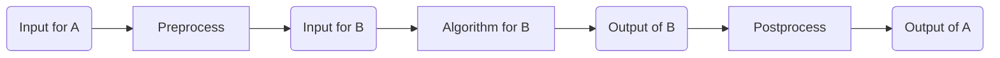

# 10.1: Linear Programming

## 10.1.1: Optimization Problems
Many computational tasks involve optimization, such as finding the shortest path, minimum cost spanning tree, or longest common subsequence. These values must be found within some constraints. 
*   **Shortest path**: Follows edges in the graph.
*   **Spanning tree**: Is a subset of the given edges.
*   **Subsequence**: Letters are from the given words.

## 10.1.2: Definition of Linear Programming
Linear programming is a general class of problems where constraints and the objective to be optimized are linear functions. A linear function is something where you have a variable multiplied by a constant, but you do not have variables multiplied by each other (e.g., no $x^{2}$ or $x \times y$).

*   **Constraints**: $a_{1}x_{1} + a_{2}x_{2} + \dots + a_{m}x_{m} \le K$, $b_{1}x_{1} + b_{2}x_{2} + \dots + b_{m}x_{m} \ge L, \dots$.
*   **Objective**: $c_{1}x_{1} + c_{2}x_{2} + \dots + c_{m}x_{m}$.

The goal is to find the optimum values for $x_{1}$ to $x_{m}$, subject to these constraints, which optimizes (maximizes or minimizes) that objective.

## 10.1.3: Example - Maximize Profits (Grandiose Sweets)
Grandiose Sweets sells cashew barfis and dry fruit halwa.
*   Profit for each box of barfis is Rs 100.
*   Profit for each box of halwa is Rs 600.
*   Daily demand for barfis is at most 200 boxes.
*   Daily demand for halwa is at most 300 boxes.
*   Staff can produce 400 boxes a day, altogether.
*   **Goal**: What is the most profitable mix of barfis and halwa to produce?.

### Linear Programming Model
*   $b$: boxes of barfi to produce per day.
*   $h$: boxes of halwa to produce per day.
*   **Objective**: Maximize $100b + 600h$.
*   **Demand Constraints**: $b \le 200$, $h \le 300$.
*   **Production Constraint**: $b + h \le 400$.
*   **Implicit Constraints**: $b \ge 0, h \ge 0$.

## 10.1.4: Solving Linear Programs - Pictorial Approach
The constraints define a **feasible region**. Any combination of $b$ and $h$ in this region satisfies all constraints.
*   At $(0, 100)$: Profit $c = 100(0) + 600(100) = 60,000$.
*   At $(0, 200)$: Profit $c = 120,000$.
*   At $(0, 300)$: Profit $c = 180,000$.
*   At $(100, 300)$: Profit $c = 100(100) + 600(300) = 190,000$.

> [!IMPORTANT]
> **Vertex Property**: The optimal value always lies at a vertex of the feasible region.

## 10.1.5: The Simplex Algorithm
Simplex is a classical algorithm that exploits the vertex property.
1.  Start at any vertex and evaluate the objective.
2.  If an adjacent vertex has a better value, move there.
3.  If the current vertex is better than all neighbors, stop.

**Complexity**: Can be exponential in the worst case, but is efficient in practice. Theoretically efficient (polynomial time) algorithms also exist.

## 10.1.6: Existence of Solutions
*   **Feasible region is convex**: A shape is convex if any two points inside it can be connected by a line that stays entirely within the shape.
*   **Empty region**: Constraints may be unsatisfiable, resulting in no solution.
*   **Unbounded**: There may be no upper/lower limit on the objective.

## 10.1.7: Extended Example - Almond Rasmalai
Grandiose Sweets adds almond rasmalai ($r$).
*   **Profit per box**: barfis - Rs 100, halwa - Rs 600, rasmalai - Rs 1300.
*   **Daily demand**: barfis - 200, halwa - 300, rasmalai - unlimited.
*   **Production capacity**: 400 boxes a day, altogether.
*   **Milk supply**: Limited to 600 boxes of halwa OR 200 boxes of rasmalai. Rasmalai needs 3 times as much milk.

### New Linear Program
*   **Objective**: Maximize $100b + 600h + 1300r$.
*   **Constraints**:
    *   $b \le 200$
    *   $h \le 300$
    *   $b + h + r \le 400$ (Production capacity)
    *   $h + 3r \le 600$ (Milk supply).
    *   $b, h, r \ge 0$.

**Optimum Solution**: $(0, 300, 100)$ with profit $c = 310,000$.

## 10.1.8: LP Duality
We can derive an upper bound on the objective through a linear combination of constraints.
Consider constraints:
(A) $h \le 300$
(B) $b + h + r \le 400$
(C) $h + 3r \le 600$.

Combine them as $100 \cdot (A) + 100 \cdot (B) + 400 \cdot (C)$:
$100(h) + 100(b + h + r) + 400(h + 3r) \le 100(300) + 100(400) + 400(600)$
$100b + 600h + 1300r \le 310,000$.

The LHS is the profit, and the value at $(0, 300, 100)$ matches this upper bound.

### Dual LP Problem
It is always possible to construct a linear combination of constraints that tightly captures the upper bound.
*   **Dual Goal**: Minimize the linear combination of constraints.
*   **Variables**: Multipliers for the linear combination.
*   **Implicit constraint**: Multipliers are non-negative.
*   **Theorem**: The optimum solution solves both the original (primal) and the dual LP.

---

# 10.2: Linear Programming: Production Planning

## 10.2.1: Production Planning Scenario - Handwoven Carpets
A company makes handwoven carpets. The production parameters are as follows:
*   **Workforce**: The company has 30 employees at the beginning of the year.
*   **Standard Production**: Each employee produces 20 carpets a month.
*   **Wages**: Each employee is paid a salary of Rs 20,000.
*   **Labor Cost**: The labor cost is Rs 1,000 per carpet ($20,000 / 20 = 1,000$).
*   **Seasonal Demand**: Monthly demand varies from January to December, represented as $d_{1}, d_{2}, \dots, d_{12}$.

## 10.2.2: Coping with Varying Demand
To meet demand that fluctuates above or below the standard capacity of 600 carpets ($30 \text{ workers} \times 20 \text{ carpets}$), the business has several options:

1.  **Overtime**:
    *   Workers are paid 80% extra for overtime carpets.
    *   The cost of an overtime carpet is Rs 1,800 (Rs 1,000 regular cost + Rs 800 bonus).
    *   Overtime limit is 30% per worker, meaning a worker can make at most 6 extra carpets per month (26 total).
2.  **Hiring and Firing**:
    *   **Hiring Cost**: Rs 3,200 per worker (due to training, searching, etc.).
    *   **Firing Cost**: Rs 4,000 per worker (due to bonus for hardship, etc.).
3.  **Surplus Storage**:
    *   Excess carpets made in one month can be stored to meet future demand.
    *   **Storage Cost**: Rs 80 per carpet per month.

## 10.2.3: Formulating the Linear Program
To find the minimum cost to meet monthly demand exactly for 12 months, the problem is modeled using 74 variables.

### Variables
For each month $i \in \{1, 2, \dots, 12\}$:
*   $w_{i}$: number of workers employed in month $i$.
*   $x_{i}$: total carpets made in month $i$.
*   $o_{i}$: carpets made in overtime during month $i$.
*   $h_{i}$: workers hired at the start of month $i$.
*   $f_{i}$: workers fired at the start of month $i$.
*   $s_{i}$: surplus carpets stored after month $i$.

**Boundary Conditions**:
*   $w_{0} = 30$ (initial workforce).
*   $s_{0} = 0$ (initial inventory).

### Constraints
For each month $i \in \{1, 2, \dots, 12\}$, the following linear constraints must be satisfied:

1.  **Non-negativity**: All variables must be greater than or equal to zero.
    *   $w_{i}, x_{i}, o_{i}, h_{i}, f_{i}, s_{i} \ge 0$.
2.  **Production Composition**: Total carpets made equals regular production plus overtime production.
    *   $x_{i} = 20w_{i} + o_{i}$.
3.  **Workforce Consistency**: The number of workers must match hiring and firing actions.
    *   $w_{i} = w_{i-1} + h_{i} - f_{i}$.
4.  **Inventory Consistency**: Stored carpets are connected to the earlier stock, current production, and current demand.
    *   $s_{i} = s_{i-1} + x_{i} - d_{i}$.
5.  **Overtime Limit**: Overtime production is at most 6 carpets per worker (30% of regular production).
    *   $o_{i} \le 6w_{i}$.

### Objective Function
The goal is to **minimize the total cost** over 12 months:
$$\text{Minimize: } 20000(w_{1} + \dots + w_{12}) + 3200(h_{1} + \dots + h_{12}) + 4000(f_{1} + \dots + f_{12}) + 80(s_{1} + \dots + s_{12}) + 1800(o_{1} + \dots + o_{12})$$.

> [!NOTE]
> The objective includes the full salary for all workers, hiring/firing fees, storage fees, and the total cost (Rs 1,800) for every carpet made during overtime.

## 10.2.4: Solving the Linear Program
The linear program can be solved using the **Simplex algorithm**.

### Fractional vs. Integer Solutions
A standard linear program solution may result in fractional values (e.g., hiring 10.6 workers in March).
*   **Rounding**: One approach is to round the fraction to the nearest integer (e.g., 10 or 10) and recompute the cost.
    *   If the values are "large," rounding does not affect the quality of the solution much.
    *   If the values are "small," rounding requires more care as it can significantly change the overall cost.
*   **Integer Linear Programming (ILP)**: Insisting that variables must be integers (since people and carpets are indivisible) makes the problem **computationally intractable**.
*   **Intractability**: Computationally intractable means there is no clever shortcut; an exhaustive search of integer points within the feasible region may be unavoidable in the worst case.

---

# 10.3: Linear Programming: Bandwidth Allocation

## 10.3.1: Network Bandwidth Scenario
A telecom network or an internet service provider (ISP) has three users (or locations of a company), **A**, **B**, and **C**, that need to be connected to each other. The hubs maintained by the ISP are represented as **a**, **b**, and **c**. Each company office is linked to its nearest hub, and these hubs are linked to each other.

*   **Capacity Constraints**: Each link has a bandwidth capacity measured in Mbps.
    *   Example: No more than 10 Mbps can flow between hub **b** and office **B**.
*   **Service Requirements**: Each connection between pairs (A-B, B-C, A-C) must have a minimum of **2 Mbps** of bandwidth.
*   **Connection Types**: Bandwidth is not affected by the number of hops. Both direct (short) and indirect (long) connections are allowed.
    *   **A-B Short Route**: A-a-b-B.
    *   **A-B Long Route**: A-a-c-b-B.
*   **Revenue**: The ISP earns differential revenue per Mbps for each route.
    *   **A-B**: Rs 300/Mbps.
    *   **B-C**: Rs 200/Mbps.
    *   **A-C**: Rs 400/Mbps.

**Goal**: Allocate bandwidth across the network to **maximize revenue** while satisfying all capacity and service constraints.

## 10.3.2: Formulating the Linear Program
To model this, variables are created for each possible route between the offices.

### Variables
Let $x$ denote a short route and $y$ denote a long route.
*   $x_{AB}, y_{AB}$: Bandwidth for A-B via short and long connections.
*   $x_{AC}, y_{AC}$: Bandwidth for A-C via short and long connections.
*   $x_{BC}, y_{BC}$: Bandwidth for B-C via short and long connections.

### Constraints
The constraints must reconcile the link capacities with the traffic flowing across them.

1.  **Link Capacity Constraints**: The sum of all traffic on a specific edge cannot exceed its Mbps capacity.
    *   **Edge b-B (Capacity 10)**: $x_{AB} + y_{AB} + x_{BC} + y_{BC} \le 10$.
    *   **Edge a-A (Capacity 12)**: $x_{AB} + y_{AB} + x_{AC} + y_{AC} \le 12$.
    *   **Edge c-C (Capacity 8)**: $x_{AC} + y_{AC} + x_{BC} + y_{BC} \le 8$.
    *   **Internal Edge a-b (Capacity 6)**: $x_{AB} + y_{AC} + y_{BC} \le 6$ (Each internal link supports one short and two long edges).
    *   **Internal Edge a-c (Capacity 13)**: $y_{AB} + x_{BC} + y_{AC} \le 13$.
    *   **Internal Edge b-c (Capacity 10)**: $y_{AB} + y_{BC} + x_{AC} \le 10$.

2.  **Service Quality Constraints**: Minimum pairwise bandwidth must be at least 2 Mbps.
    *   $x_{AB} + y_{AB} \ge 2$.
    *   $x_{BC} + y_{BC} \ge 2$.
    *   $x_{AC} + y_{AC} \ge 2$.

3.  **Implicit Constraints**: Traffic on all routes must be non-negative.
    *   $x_{AB}, y_{AB}, x_{AC}, y_{AC}, x_{BC}, y_{BC} \ge 0$.

### Objective Function
Maximize the total revenue earned from allocated bandwidth:
$$\text{Maximize: } 300(x_{AB} + y_{AB}) + 200(x_{BC} + y_{BC}) + 400(x_{AC} + y_{AC})$$

## 10.3.3: Solution and Analysis
Using the **Simplex algorithm**, the following optimal values are obtained:
*   $x_{AB} = 0, y_{AB} = 7$ (Total A-B bandwidth = 7).
*   $x_{BC} = 1.5, y_{BC} = 1.5$ (Total B-C bandwidth = 3).
*   $x_{AC} = 0.5, y_{AC} = 4.5$ (Total A-C bandwidth = 5).

> [!NOTE]
> **Observations on Solution**:
> *   **Fractional Values**: Unlike production planning (people/carpets), bandwidth is infinitely divisible, so fractional solutions are perfectly acceptable.
> *   **Saturation**: In this solution, all edges are at full capacity except for edge **a-c**.
> *   **Revenue Logic**: The least allocation is given to the B-C route (3 Mbps), which provides the lowest revenue (Rs 200/Mbps).

## 10.3.4: Limitations of the LP Modeling Strategy
The current strategy of using one variable per path **does not scale well**.

*   **Exponential Growth**: In general, the number of possible paths between any two nodes in a graph is **exponential**.
*   **Large Encodings**: If one variable is constructed for every possible route, the resulting linear program becomes excessively large relative to the original graph.
*   **Alternative Approach**: Such problems are more effectively solved using a better approach to analyze **network flows** directly on the graph rather than converting them to a standard linear program with path-based variables.

---

# 10.4: Network Flows

## 10.4.1: The Oil Network Example
Imagine we have a network of pipelines. We are trying to transport oil from one place to another place. The edges represent the directions in which the oil will flow, and the capacities of each of the pipelines is the number indicated.

*   **Goal**: Ship as much oil as possible from the source $s$ to the target (sink) $t$.
*   **Constraints**: There is no storage along the way. All the liquid must flow; we cannot transport 3 units to a node and move only 1 unit out in another direction. Everything must keep flowing.

## 10.4.2: Formal Definitions
Formally, a network is a graph $G = (V, E)$.
*   **Special Nodes**: $s$ (source) and $t$ (sink).
*   **Edge Capacity**: Each edge $e$ has a capacity $c_{e}$.
*   **Flow**: $f_{e}$ for each edge $e$.

### The Constraints
1.  **Capacity Constraint**: $f_{e} \le c_{e}$ for each edge $e$. The quantity that flows through each pipe cannot exceed its capacity.
2.  **Conservation of Flow**: At each node, except $s$ and $t$, the sum of incoming flows must equal the sum of outgoing flows.
3.  **Total Volume**: The total volume of flow is the sum of the outgoing flow from $s$. Alternatively, it is the sum of the incoming edges of the target $t$.

## 10.4.3: Linear Programming (LP) Formulation
Network flow can be captured as an LP problem using variables for each edge rather than paths.

*   **Variables**: $f_{e}$ for each edge $e$ (e.g., $f_{sa}, f_{bd}, f_{ce}, \dots$).
*   **Capacity Constraints**: $f_{ba} \le 10, \dots$ (one per edge).
*   **Conservation Constraints**: $f_{ad} + f_{bd} = f_{dc} + f_{de} + f_{dt}, \dots$ (one per internal node).
*   **Objective**: Maximize flow volume (e.g., Maximize $f_{sa} + f_{sb} + f_{sc}$).

> [!NOTE]
> Simplex explores vertices of the feasible region to find the maximum flow. Moving from vertex to vertex directly gives a more direct algorithm for maximum flow without invoking Simplex.

## 10.4.4: The Ford-Fulkerson Algorithm
This algorithm starts with zero flow and incrementally augments it.

1.  **Start with zero flow**.
2.  **Find a path**: Choose a path from $s$ to $t$ that is not saturated.
3.  **Augment flow**: Increase the flow along this path as much as possible given the path's capacity.
4.  **Build residual graph**: Update capacities to account for the new flow and add reverse edges.
5.  **Repeat**: Continue the process until there is no feasible flow from $s$ to $t$ in the residual graph.

## 10.4.5: Residual Graphs
If a bad path is chosen initially, we need a way to "undo" that flow.
*   **Reverse Edges**: For each edge $e$ with capacity $c_{e}$ and current flow $f_{e}$:
    *   **Reduce forward capacity** to $c_{e} - f_{e}$.
    *   **Add a reverse edge** with capacity $f_{e}$.
*   The reverse edge allows us to "push back" flow, which is effectively the same as reducing the original forward flow.

## 10.4.6: Max Flow-Min Cut Theorem
How do we know the achieved flow is maximum? We use a **Certificate of Optimality**.

*   **$(s, t)$-cut**: A set of edges that disconnects $s$ and $t$. It partitions the graph into a part containing $s$ and a part containing $t$.
*   **Cut Capacity**: Any flow from $s$ to $t$ must go through the edges of the cut. Therefore, the flow cannot exceed the cut capacity.
*   **The Theorem**: In fact, the max flow is always equal to the capacity of the minimum cut.
*   **At Max Flow**: In the residual graph, there is no path from $s$ to $t$. Any edge from the $s$-side ($L$) to the $t$-side ($R$) must be at full capacity, and any edge from $R$ to $L$ must be at zero capacity.

## 10.4.7: Efficiency and Augmenting Paths
The Ford-Fulkerson algorithm can be inefficient if augmenting paths are chosen poorly.
*   **Proportional to Capacity**: In some cases, it can take time proportional to the maximum capacity (e.g., 200 iterations for a flow of 200).
*   **BFS Improvement (Edmonds-Karp)**: Use **Breadth-First Search (BFS)** to find the augmenting path with the fewest edges.
*   **Guaranteed Complexity**: With the BFS heuristic, the number of iterations is bounded by $|V| \times |E|$, regardless of the actual capacity values. This makes the complexity proportional to the size of the graph.

---

# 10.5: Reductions

## 10.5.1: Bipartite Matching
A specific problem that can be modeled using network flows is **bipartite matching**.

### Scenario: Course Allocation
*   Each instructor is willing to teach a set of courses.
*   **Goal**: Find an allocation so that:
    1.  Each course is taught by a single instructor.
    2.  Each instructor teaches only one course, which he/she is willing to teach.
*   The allocation must respect the preferences (edges).

### Formal Definition
*   The vertex set $V$ is partitioned into $V_{0}$ and $V_{1}$.
*   All edges go from $V_{0}$ to $V_{1}$.
*   **Matching**: A subset of edges so that no two of them share an endpoint.
*   **Largest Matching**: Find a matching with the maximum number of edges.
*   **Perfect Matching**: A matching where all nodes are covered.

## 10.5.2: Reducing Bipartite Matching to Max Flow
To solve bipartite matching using max flow, the graph is modified:
1.  Add a **source** $s$ and a **sink** $t$.
2.  Add directed edges from $s$ to every vertex in $V_{0}$.
3.  Add directed edges from every vertex in $V_{1}$ to $t$.
4.  Set all edge capacities to **1**.
5.  Find a **maximum flow** from $s$ to $t$.

The edges between $V_{0}$ and $V_{1}$ that carry flow in the max flow solution correspond to the edges in the matching.

## 10.5.3: Formal Definition of Reductions
A reduction is a method used to solve problem $A$ by using an algorithm for another problem $B$.

### The Reduction Process
1.  **Preprocess**: Convert the input for $A$ (denoted $x$) into an appropriate input for $B$ (denoted $y$).
2.  **Apply Algorithm**: Solve problem $B$ using the converted input $y$ to get output $B(y)$.
3.  **Postprocess**: Interpret the output $B(y)$ as a valid output for the original problem $A(x)$.

## 10.5.4: Efficiency and Polynomial Time
For a reduction to be useful in transferring efficient solutions from $B$ to $A$:
*   Preprocessing and postprocessing must be **efficient**.
*   Typically, both should run in **polynomial time** relative to the size of the input for $A$.
*   The size of the output from $B$ must also not be too large to allow polynomial-time reconstruction of the answer for $A$.

## 10.5.5: Chain of Reductions
Reductions can be chained to show a hierarchy of problem-solving techniques:
*   **Bipartite Matching** reduces to **Max Flow**.
*   **Max Flow** reduces to **Linear Programming (LP)**.
    *   In the reduction from Max Flow to LP, the number of variables and constraints is **linear** in the size of the graph.
    *   One variable is attached for each flow $f_{e}$.
    *   Constraints express that flows respect edge capacities and that flow is conserved at each internal node.

## 10.5.6: Reverse Interpretation (Intractability)
Reductions are also used to prove that problems are difficult.
*   **Theorem**: If problem $A$ is known to be **intractable** and $A$ reduces to $B$, then $B$ must also be **intractable**.
*   **Reasoning**: If $B$ could be solved efficiently, then an efficient solution for $A$ would be possible through the reduction, contradicting the fact that $A$ is hard.

## 10.5.7: Powerful Computational Tools ("Big Hammers")
Linear Programming and network flows are considered "big hammers".
*   They are very powerful techniques to which many other algorithmic problems can be reduced.
*   Efficient, off-the-shelf implementations (libraries) are publicly and commercially available in languages like Python.
*   It is useful to understand what can and cannot be modeled in terms of LP and flows to leverage these existing solvers.

---

# 10.6: Intractability - Checking Algorithms

## 10.6.1: Context - Efficient Algorithms
Till now the focus of the course has been on trying to find efficient algorithms, but sometimes efficient algorithms do not exist.
*   **Efficient Problems**: Shortest path, minimum cost spanning tree, and maximum flow have polynomial time algorithms ($O(n \log n)$, $O(n^{3})$, etc.).
*   **Definition of Efficient**: In the abstract perspective of algorithms, anything of the form polynomial $n^{k}$ for some fixed $k$ is considered to be good.
*   **Pruning the Search Space**: While the search space for solutions is often exponential (all possible paths, all possible spanning trees), efficient algorithms find the correct solution without examining every possibility.
*   **The Problem**: For a large class of "natural" problems, no shortcut (polynomial time algorithm) is known to exist. Brute force—scanning exponential possibilities—is the only known way, making them computationally intractable.

## 10.6.2: Generating vs. Checking
There is an intuitive difference between finding an answer and verifying an answer.

**The Homework Example (Factorization)**:
*   **Teacher's Task**: Give a student a large number $N$ that is the product of two large primes $p$ and $q$. Ask the student to find $p$ and $q$.
*   **Student's Task (Generate a solution)**: The student must find $p, q$ such that $pq = N$. This is complicated because they must search through all primes up to $p$. No known efficient way exists to generate this solution.
*   **Teacher's Task (Check a solution)**: Given the student’s proposed factors $p$ and $q$, the teacher simply multiplies them. This is a simple, efficient procedure to validate if $pq = N$.

### Defining Checking Algorithms
A checking algorithm $C$ for a problem $P$ takes two inputs:
1.  An **input instance** $I$ for the problem $P$.
2.  A **solution "certificate"** $S$ for the instance $I$.
The algorithm $C$ outputs **yes** if $S$ represents a valid solution for $I$, and **no** otherwise.

> [!NOTE]
> For factorization, $I$ is $N$, $S$ is $\{p, q\}$, and $C$ involves verifying that $pq = N$.

## 10.6.3: Boolean Satisfiability (SAT)
Boolean satisfiability is central to the notion of intractability.
*   **Variables**: $x_{1}, x_{2}, x_{3}, \dots$ can take values $\{\text{True, False}\}$.
*   **Operators**:
    *   $\neg x_{i}$ : Negation (NOT)
    *   $x_{i} \vee x_{j}$ : Disjunction (OR)
    *   $x_{i} \wedge x_{j}$ : Conjunction (AND).
*   **Clause**: A disjunction of literals (variables or negated variables). Example: $(x_{1} \vee \neg x_{2} \vee x_{3})$.
*   **Formula**: A conjunction of clauses: $C_{1} \wedge C_{2} \wedge \dots \wedge C_{k}$.

**Goal**: Assign values to $x_{1}, x_{2}, \dots$ such that the formula evaluates to **True**.

### SAT Complexity
*   **Generating a solution**: With $n$ variables, there are $2^{n}$ possible assignments. No better algorithm is known than trying each one.
*   **Checking a solution**: Given a formula $F$ and a valuation $V(x)$, substitute the values and evaluate. This is efficient and can be done in linear time.

### Importance of Input Format (CNF)
Satisfiability must be stated in **Conjunctive Normal Form** (ORs inside clauses, ANDs between clauses).
If the format were reversed (a disjunction of conjunctions):
$$(x_{1} \wedge \neg x_{2} \wedge x_{3}) \vee (x_{2} \wedge \neg x_{4}) \dots$$
Then each clause forces a unique valuation, and the problem becomes trivial because you only need to find one satisfiable clause to make the whole formula True.

## 10.6.4: Travelling Salesman Problem (TSP)
*   **Input**: A network of cities with distances between each pair (a complete graph $G=(V,E)$ with edge weights).
*   **Goal**: Find the shortest tour (simple cycle) that visits each city exactly once.

### Designing a Checking Algorithm for TSP
If a solution $S$ (a cycle) is proposed, we can easily verify if it is a cycle and compute its cost.
**The Bottleneck**: How to check that $S$ is the **least cost** cycle? There is no reference to validate that no shorter cycle exists.

**Transformation to a Checking Version**:
Ask: "Is there a tour with cost at most $K$?".
*   Now, given a solution $S$, we can check if its cost is $\le K$.
*   To find the optimum, test different values of $K$ using **binary search**.

## 10.6.5: Independent Set
*   **Independence**: Two nodes $u, v$ are independent if there is no edge $(u,v)$ between them.
*   **Independent Set**: A set $U$ where each pair $u, v \in U$ is independent.
*   **Problem**: Find the largest independent set in a given graph.
*   **Checking Version**: Is there an independent set of size $K$?.
*   

## 10.6.6: Vertex Cover
*   **Coverage**: Node $u$ covers every edge $(u,v)$ incident on it.
*   **Vertex Cover**: A set $U$ where every edge in the graph is incident on at least one vertex in $U$.
*   **Problem**: Find the smallest vertex cover in a given graph.
*   **Checking Version**: Is there a vertex cover of size $K$?.

## 10.6.7: Connecting Independent Set and Vertex Cover
The two problems are duals of each other.
**Theorem**: $U$ is an independent set of size $K$ if and only if $V \setminus U$ (the complement) is a vertex cover of size $N-K$.

**Proof**:
*   ($\Rightarrow$) If $U$ is an independent set, every edge $(u,v)$ has at most one endpoint in $U$. Therefore, at least one endpoint must be in the complement $V \setminus U$, making it a vertex cover.
*   ($\Leftarrow$) If $V \setminus U$ is a vertex cover, then for any edge $(u,v)$, at least one endpoint is in $V \setminus U$. This implies there can be no edge $(u,v)$ where both endpoints are in $U$, making $U$ an independent set.

## 10.6.8: Reductions
Independent set and vertex cover **reduce to each other**.
*   If we can solve one efficiently, we can solve the other.
*   If one is known to be intractable and $A$ reduces to $B$, then $B$ must also be intractable.
*   Many pairs of checkable problems are inter-reducible and thus "equally hard".

---

# 10.7: Intractability - P and NP

## 10.7.1: The Class NP
The class **NP** is defined by the existence of a **checking algorithm** $C$ that can verify a solution "certificate" $S$ for an input instance $I$ in time that is polynomial in the $size(I)$. 

### Characteristics of NP
*   **Polynomial Certificate**: For the check to be efficient, the solution $S$ presented to the algorithm must also be small (polynomial in the size of input $I$); a gigantic certificate cannot be validated in polynomial time.
*   **Optimization to Checking**: Optimization problems can be converted into checking problems by providing a bound $K$ (e.g., "Is there a tour with cost at most $K$?"). This transformation adds only a logarithmic factor to the complexity because one can perform a binary search through the solution space.
*   **Examples in NP**: Factorization, Boolean satisfiability (SAT), the Traveling Salesman Problem (TSP), vertex cover, and independent set are all members of the class NP.

### Why "NP"?
The name stands for **Non-deterministic Polynomial time**. 
*   **Concept**: It involves "guessing" a correct solution (non-determinism) and then validating that guess in polynomial time.
*   **Theoretical Origins**: The term originates from computability theory and is formally defined via **non-deterministic Turing machines**.

## 10.7.2: The Class P
**P** is the class of problems that admit regular, deterministic polynomial-time algorithms for their worst-case complexity. 

### Relationship Between P and NP
*   **Inclusion**: $P \subseteq NP$. 
*   **Reasoning**: If a problem can be solved from start to finish in polynomial time, it is inherently checkable in polynomial time. To check a claimed solution, one could simply generate their own solution in polynomial time and compare the two.

## 10.7.3: The $P = NP$ Question
The central question in theoretical computer science asks if $P = NP$, or whether efficient checking is fundamentally the same as efficient generation.

*   **Intuition**: Intuitively, checking should be easier than generation. For example, it is much harder for a student to find two large prime factors of $N$ than it is for a teacher to multiply them to verify the answer.
*   **General Belief**: Most researchers believe $P \ne NP$. 
*   **Formal Evidence**: Many "natural" problems in NP are inter-reducible. If a polynomial-time algorithm is found for just one of these hard problems, it would yield efficient solutions for all of them, implying $P = NP$.

## 10.7.4: Reductions Within NP
Reductions allow problems to be transformed into one another, proving they are "equally hard".

### Reducing SAT to 3-SAT
The standard Boolean Satisfiability problem (SAT) can be reduced to **3-SAT**, where each clause contains at most three literals.
*   **Process**: A clause with more than three literals is split by introducing new variables. 
*   **Example**: A 5-literal clause $(v \vee \neg w \vee x \vee \neg y \vee z)$ is split into $(v \vee \neg w \vee a) \wedge (\neg a \vee x \vee \neg y \vee z)$. This new formula is satisfiable if and only if the original clause was.
*   **Conclusion**: Since this process can be repeated for all large clauses, if SAT is hard, 3-SAT must also be hard.

### Reducing 3-SAT to Independent Set
A 3-SAT formula can be transformed into a graph problem.
1.  **Nodes**: Create one node per literal in the formula.
2.  **Triangle Edges**: Connect nodes representing literals within the same clause to form a triangle (or an edge if the clause has only two literals).
3.  **Consistency Edges**: Connect every literal to its negation wherever it appears in other clauses.
4.  **Goal**: An independent set in this graph must pick exactly one literal per clause to satisfy the formula while consistency edges prevent setting a variable to both True and False.

### Chain of Transitivity
Reductions are transitive. Because $SAT \to 3-SAT \to \text{Independent Set} \to \text{Vertex Cover}$, it follows that SAT reduces to Vertex Cover. Other inter-reducible problems include Traveling Salesman and Integer Linear Programming.

## 10.7.5: NP-Completeness
A problem is **NP-complete** if it is both in the class NP and every other problem in NP reduces to it.

*   **Cook-Levin Theorem**: This fundamental theorem proves that every problem in NP can be reduced to SAT. 
*   **Proving Completeness**: To show a new problem $P$ is NP-complete, one must show $P \in NP$ and then reduce a known NP-complete problem (like SAT or 3-SAT) to $P$.
*   **Representative Nature**: NP-complete problems are representatives of the hardest problems in NP; solving any one of them in polynomial time would prove $P = NP$.

## 10.7.6: Current Status of $P \ne NP$
*   **Practical Scope**: Many commercially important tasks, such as scheduling, bin-packing, and finding optimal tours, are NP-complete. 
*   **Empirical Evidence**: Despite centuries of work by mathematicians and researchers, no efficient algorithm has been found for any of these problems. 
*   **The Prize**: A formal proof that $P \ne NP$ (or $P = NP$) is considered one of the greatest unsolved problems in mathematics and carries a **\$1 million prize** from the Clay Mathematics Institute.

> [!IMPORTANT]
> The Cook-Levin theorem is approximately 50 years old (1971). Despite decades of formulate and study, the computer science community is "no closer" to proving the $P \ne NP$ conjecture, though it is strongly believed to be true.
