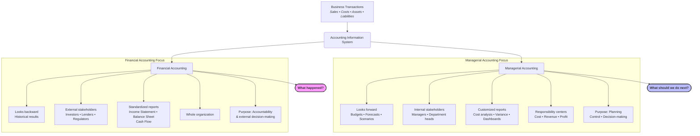

# Week 5: Accounting Fundamentals

## 1. Overview of the Accounting Function and Disciplines

The accounting function plays a critical role in business data management by translating daily business transactions into structured financial information. This week deconstructs the two primary accounting disciplines, their objectives, and reporting audiences.

### Financial Accounting
*   **Definition:** Financial accounting is the discipline primarily concerned with identifying, measuring, and reporting financial data to external stakeholders [32].
*   **Target Audience:** External users, including regulators, tax authorities, banks, and shareholders [32].
*   **Primary Output:** Standardized, structured reports such as the Balance Sheet, Income Statement, and Cash Flow Statement [32].
*   **Major Limitation of Financial Accounting:** Standardized financial reports are purely historical (looking backward at past performance) and ignore critical qualitative or non-financial metrics, such as employee productivity, customer satisfaction, or operational efficiency [33].

### Managerial (Management) Accounting
*   **Definition:** Managerial accounting is the internal discipline focused on identifying, measuring, and reporting financial and non-financial data to help managers plan, analyze, and make strategic decisions [15].
*   **Target Audience:** Internal users, specifically senior management, department heads, and operational supervisors [15, 33].
*   **Primary Output:** Cost analyses, budget forecasts, variance reports, and capital investment recommendations [15, 35].
*   **Responsibility Centers:** To track performance and apply accountability, management accounting divides an organization into "responsibility centers," such as cost centers (focused purely on expense control) and investment centers [34]. This segmentation allows management to identify the specific departments or divisions responsible for cost overruns or capital inefficiencies [34].
*   **Performance/Variance Analysis Reports:** These reports assist managers by comparing planned or budgeted performance against actual operational outputs [35]. Analyzing these variances (favorable or adverse differences) enables timely corrective action [35].

## 2. Fundamental Accounting Principles

To ensure consistency, accuracy, and reliability, financial transactions must be recorded under established accounting principles:

### A. Measurement Principle (Historical Cost Principle)
*   **Definition:** Under the Measurement Principle, assets must be recorded and carried on the books at their original historical cost (the actual transaction price at the time of purchase), regardless of fluctuations in current market values over time [17].
*   **Example Case:** If a company purchased land for ₹100,000 a decade ago, and its current market value has appreciated to ₹500,000, the land must still be recorded on the Balance Sheet at its original cost of **₹100,000** [17].

### B. Revenue Recognition Principle
*   **Definition:** This principle dictates that revenue must be recorded on the books in the period when the product is delivered or the service is performed, regardless of when the cash payment is actually received from the customer [17].
*   **Timing Example:** A business delivers a product to a customer in October, but the customer does not make the cash payment until December [17]. Under the Revenue Recognition Principle, the revenue is officially recorded in **October** (when the goods were provided), not in December [17].
*   **Ravi's Daily Revenue Case:** Ravi operates a business and has ₹300 in cash sales and ₹200 in credit sales on June 1st [18]. Under this principle, credit sales are recognized as revenue when earned [18]. Therefore, Ravi's total revenue for June 1st is:
    $$\text{Total Revenue} = \text{Cash Sales} + \text{Credit Sales} = ₹300 + ₹200 = ₹500 \quad \text{[18]}$$

### C. Business Entity Concept (Separate Entity Principle)
*   **Definition:** This concept states that a business is a completely distinct and separate legal entity from its owners or founders [453, 982].
*   **Capital as a Liability:** Because of this separation, any "Capital" invested by the owner is considered a liability from the business's perspective, representing the amount the business owes back to the owner [453, 982]. If the owner decides to close the business, they have the right to withdraw this capital [453, 982].

## 3. Balance Sheet Classifications and Components

The Balance Sheet is divided into Assets, Liabilities, and Equity. To assist in liquidity and operations analysis, assets and liabilities are classified as follows:

### Assets Side
Assets represent resources owned by the business that carry future economic value to help generate revenue [21].
1.  **Current Assets:** Assets that are meant for liquidity and daily operations, typically expected to be converted into cash, sold, or consumed within one year [16].
    *   *Examples:* Cash, Inventory (stock of raw materials/finished goods), Accounts Receivable (Debtors), and Prepaid Expenses [16, 21].
2.  **Fixed (Non-Current) Assets:** Long-term tangible resources meant for persistent use in business operations to help generate revenue, rather than for resale [16].
    *   *Examples:* Buildings, Machinery, and Land [16, 21].
3.  **Prepaid Expenses:** Cash payments made in advance for services or rent that have not yet been consumed [19]. They are classified as Current Assets until the period they are utilized [19].
    *   *Prepaid Rent Example:* Ravi pays ₹2,100 for a full week's rent on Day 1 [19]. At the end of Day 1, only ₹300 worth of rent has been consumed (used up) [19]. The remaining unused rent of **₹1,800** is classified on the Balance Sheet as a **Prepaid Expense (Current Asset)** [19].
4.  **Asset vs. Expense Distinction (Lemonade Stand Case):**
    *   *Why is the juice machine considered an Asset while the sugar is considered an Expense?* [20]
    *   *Explanation:* The sugar provides immediate, used-up value within the current operational cycle and is consumed during production, making it an **Expense** [21]. Conversely, the juice machine is not consumed immediately; it remains in the stand to help generate revenue over multiple future periods, making it an **Asset** [21].
5.  **Context-Dependent Categorization:** The classification of an item as an asset or inventory is strictly dependent on the business's core operations [15]. For instance, a building is categorized as **Inventory** for a real estate firm that intends to sell it to customers, whereas it is categorized as a **Fixed Asset** for a manufacturing firm that uses it as a factory [15, 16].

### Liabilities Side
Liabilities are obligations or debts that the business owes to external parties:
1.  **Current Liabilities:** Obligations that are expected to be settled within one year [21].
    *   *Example:* Creditors (Accounts Payable) [21].
2.  **Non-Current Liabilities:** Long-term debts or borrowings [2].

### Equity Side
Equity represents the owner's residual interest in the business:
1.  **Equity Share Capital:** The nominal or face value of outstanding shares [2].
2.  **Securities Premium:** If a company issues shares above their face value, the excess amount is recorded in the Securities Premium account under reserves [20].
    *   *Example:* If a company issues a share with a face value of ₹10 at a market price of ₹50, the extra **₹40** is recorded in the **Securities Premium** account [20].
3.  **Drawings:** Cash or assets withdrawn by the owner from the business for personal use [450, 979]. This transaction directly reduces Owner's Equity [450, 979].
    *   *Example:* If Rohan takes ₹3,000 from his business to pay his personal house rent, it is recorded as **Drawings**, reducing Owner's Equity [450, 979].

## 4. Capital and the Accounting Equation

The fundamental accounting equation is the foundation of double-entry bookkeeping and must remain balanced at all times:
$$\text{Assets} = \text{Liabilities} + \text{Equity}$$

Every business transaction impacts the components of this equation in a way that preserves this equilibrium. Let's analyze key transactional scenarios:

### Case A: रमेश (Ramesh) Capital Investment
*   **Transaction:** रमेश (Ramesh) invests ₹200,000 in cash to start his business [451, 980].
*   **Impact on Accounting Equation:**
    $$\text{Assets (Cash)} \uparrow \text{ by ₹200,000} \quad \text{and} \quad \text{Owner's Equity (Capital)} \uparrow \text{ by ₹200,000} \quad \text{[451, 980]}$$
*   **Equation State:**
    $$\text{₹200,000 (Assets)} = \text{₹0 (Liabilities)} + \text{₹200,000 (Equity)}$$

### Case B: Paying Off Suppliers (Accounts Payable)
*   **Transaction:** A company has ₹10,000 in Accounts Payable and pays off ₹3,000 to its suppliers [449, 978].
*   **Impact on Accounting Equation:**
    $$\text{Assets (Cash)} \downarrow \text{ by ₹3,000} \quad \text{and} \quad \text{Liabilities (Accounts Payable)} \downarrow \text{ by ₹3,000} \quad \text{[449, 978]}$$
*   **Equation State:** Both sides of the equation decrease by exactly ₹3,000, maintaining perfect balance.

### Case C: Purchasing a Delivery Truck for Cash
*   **Transaction:** A business purchases a new delivery truck for cash [452, 981].
*   **Impact on Accounting Equation:**
    $$\text{Assets (Cash)} \downarrow \text{ by the truck's cost} \quad \text{and} \quad \text{Assets (Fixed Assets/Vehicles)} \uparrow \text{ by the truck's cost} \quad \text{[452, 981]}$$
*   **Total Assets Impact:** Total assets remain **unchanged** [452, 981]. One asset (Cash) is simply exchanged for another asset (Vehicles) of equal value, leaving the liabilities and equity sides completely unaffected.

## 5. Key Financial Calculations and Case Studies

Data analysts rely on accounting metrics to evaluate liquidity, operational performance, and profitability. Below are the key formulas and numerical case studies derived directly from the curriculum.

### Case Study 1: Working Capital Analysis
Working capital measures a company's short-term liquidity and its ability to pay off current obligations with current assets [19].
$$\text{Working Capital} = \text{Current Assets} - \text{Current Liabilities} \quad \text{[19]}$$

#### Numerical Example:
A company has the following accounts on its books:
*   Cash: ₹20,000
*   Inventory: ₹15,000
*   Machinery: ₹100,000
*   Accounts Receivable: ₹5,000
*   Creditors: ₹12,000

#### Step-by-Step Derivation:
1.  **Classify and Sum Current Assets (CA):**
    *   Cash: ₹20,000 (Current Asset)
    *   Inventory: ₹15,000 (Current Asset)
    *   Accounts Receivable: ₹5,000 (Current Asset)
    *   *Note:* Machinery (₹100,000) is a Fixed Asset and is excluded from current asset summation [21].
    $$\text{Total Current Assets (CA)} = \text{Cash} + \text{Inventory} + \text{Accounts Receivable}$$
    $$\text{Total CA} = ₹20,000 + ₹15,000 + ₹5,000 = ₹40,000 \quad \text{[21]}$$

2.  **Identify Current Liabilities (CL):**
    *   Creditors: ₹12,000 (Current Liability)
    $$\text{Total Current Liabilities (CL)} = ₹12,000 \quad \text{[21]}$$

3.  **Compute Working Capital:**
    $$\text{Working Capital} = CA - CL$$
    $$\text{Working Capital} = ₹40,000 - ₹12,000 = ₹28,000 \quad \text{[21]}$$

*   **Outcome:** The company's Working Capital is **₹28,000** [21].

### Case Study 2: Ravi's Lemonade Stand (Income Statement & Dividends)
Ravi's Lemonade Stand operates with a mix of daily variable costs, monthly fixed costs, and a dividend distribution policy [22].

#### Given Operational Data:
*   **Daily Average Sales Volume:** 60 glasses of lemonade [22]
*   **Selling Price per Glass:** ₹10 [22]
*   **Operating Period:** June (exactly 30 days) [22]
*   **Daily Operating Expenses (Variable):** ₹350 [22]
*   **Monthly Fixed Rent:** ₹500 [22]
*   **Dividend Distribution Rate:** 50% of monthly net profit [22]

#### Step-by-Step Derivation:

1.  **Calculate Monthly Total Revenue:**
    $$\text{Total Sales Revenue} = \text{Glasses Sold/Day} \times \text{Days in Month} \times \text{Price/Glass}$$
    $$\text{Total Sales Revenue} = 60 \times 30 \times ₹10 = ₹18,000 \quad \text{[22]}$$

2.  **Calculate Monthly Operating Expenses:**
    $$\text{Total Operating Expenses} = \text{Daily Expense} \times \text{Days in Month}$$
    $$\text{Total Operating Expenses} = ₹350 \times 30 = ₹10,500 \quad \text{[22]}$$

3.  **Calculate Total Costs:**
    $$\text{Total Costs} = \text{Operating Expenses} + \text{Monthly Fixed Rent}$$
    $$\text{Total Costs} = ₹10,500 + ₹500 = ₹11,000 \quad \text{[22]}$$

4.  **Calculate Monthly Net Profit:**
    $$\text{Net Profit} = \text{Total Sales Revenue} - \text{Total Costs}$$
    $$\text{Net Profit} = ₹18,000 - ₹11,000 = ₹7,000 \quad \text{[22]}$$

5.  **Calculate Dividend Distributed:**
    $$\text{Dividends Distributed} = \text{Dividend Rate} \times \text{Net Profit}$$
    $$\text{Dividends Distributed} = 50\% \times ₹7,000 = 0.50 \times ₹7,000 = ₹3,500 \quad \text{[22]}$$

6.  **Calculate Retained Earnings Remaining in the Business:**
    $$\text{Retained Earnings} = \text{Net Profit} - \text{Dividends Distributed}$$
    $$\text{Retained Earnings} = ₹7,000 - ₹3,500 = ₹3,500 \quad \text{[22]}$$

*   **Outcome:** **₹3,500** remains in the business as Retained Earnings [22].
