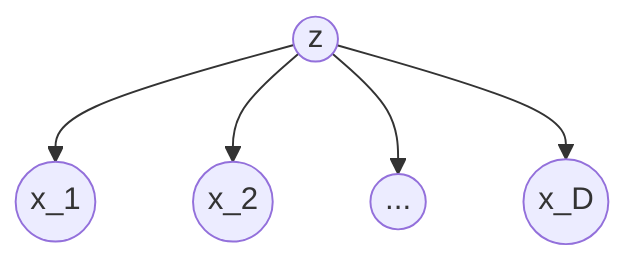

# 8.1: Foundations of Generative Classifiers & Density Estimation

## 1. General Principles of Generative Classifiers

In supervised pattern classification, the objective is to assign an input vector $\mathbf{x}$ to one of $K$ discrete classes $\mathcal{C}_k$ on the basis of a training set of $N$ observations $\{\mathbf{x}_1, \dots, \mathbf{x}_N\}$ and their corresponding target vectors $\{\mathbf{t}_1, \dots, \mathbf{t}_N\}$.

There are **three distinct approaches** to solving this classification problem:

* **Approach (a) [Generative]:** Explicitly or implicitly model the class-conditional probability density functions $p(\mathbf{x}\vert{}\mathcal{C}_k)$ for each class separately, together with the prior probabilities $p(\mathcal{C}_k)$ for the classes. Bayes' theorem is then applied to compute the posterior class probabilities $p(\mathcal{C}_k\vert{}\mathbf{x})$:
$$p(\mathcal{C}_k\vert{}\mathbf{x}) = \frac{p(\mathbf{x}\vert{}\mathcal{C}_k)p(\mathcal{C}_k)}{p(\mathbf{x})}$$

where the denominator represents the normalization constant (the marginal density of the data) and is given by:
$$p(\mathbf{x}) = \sum_{k=1}^K p(\mathbf{x}\vert{}\mathcal{C}_k)p(\mathcal{C}_k)$$

These models are termed *generative models* because by sampling from the joint distribution, it is possible to generate synthetic data points in the input space.
* **Approach (b) [Discriminative]:** Bypasses the estimation of the joint distribution and instead directly models the conditional class posterior probabilities $p(\mathcal{C}_k\vert{}\mathbf{x})$. Decision theory is then subsequently applied to assign each new input $\mathbf{x}$ to one of the classes.
* **Approach (c) [Discriminant Functions]:** Completely bypasses probability estimation and directly maps each input $\mathbf{x}$ onto a class label using a discriminant function $f(\mathbf{x})$. In this case, probabilities play no role, and the inference and decision stages are combined into a single learning problem.

## 2. Merits and Computational Demands of Generative Models

### 2.1 Parameter Scaling and Data Requirements

* **Dimensionality and Resource Demands:** Generative modeling is highly demanding because it requires finding the joint distribution over both the high-dimensional input space $\mathbf{x}$ and the classes $\mathcal{C}_k$. For high-dimensional spaces, a very large training set may be required to determine the class-conditional densities to reasonable accuracy.
* **Wasted Computation:** If the ultimate goal is only to make classification decisions, finding the joint distribution $p(\mathbf{x}, \mathcal{C}_k)$ can be computationally wasteful and excessively demanding of data. The class-conditional densities often contain substantial complex structure that has little or no effect on the final posterior probabilities.

### 2.2 Advantages Unique to Generative Models

Despite their data and parameter scaling demands, generative classifiers offer several specific advantages:

1. **Outlier and Novelty Detection:** Because they model the marginal density $p(\mathbf{x})$, generative models can detect new data points that have low probability under the model, indicating where predictions may be of low accuracy.
2. **Handling Missing Data:** Generative models can deal naturally with missing features.
3. **Model Combination and Data Fusion:** For complex applications, a large problem can be broken down into smaller, heterogeneous subproblems tackled by separate modules. For example, given independent class-conditional distributions of inputs for X-ray images $x_I$ and blood tests $x_B$, the joint class-conditional distribution factorizes:
$$p(x_I, x_B\vert{}\mathcal{C}_k) = p(x_I\vert{}\mathcal{C}_k)p(x_B\vert{}\mathcal{C}_k)$$

The combined posterior probability is then given by:
$$p(\mathcal{C}_k\vert{}x_I, x_B) \propto p(x_I, x_B\vert{}\mathcal{C}_k)p(\mathcal{C}_k) \propto p(x_I\vert{}\mathcal{C}_k)p(x_B\vert{}\mathcal{C}_k)p(\mathcal{C}_k) \propto \frac{p(\mathcal{C}_k\vert{}x_I)p(\mathcal{C}_k\vert{}x_B)}{p(\mathcal{C}_k)}$$

### 2.3 The Reject Option

By retaining posterior probabilities $p(\mathcal{C}_k\vert{}\mathbf{x})$, we can employ the reject option. Classification errors primarily occur in regions of input space where the largest posterior probability is significantly less than unity. We can achieve this by introducing a threshold $\theta$ and rejecting those inputs $\mathbf{x}$ for which the largest posterior probability satisfies:

$$\max_k p(\mathcal{C}_k\vert{}\mathbf{x}) \le \theta$$

# 8.1.1 Generative Model-Based Algorithm

## 1. The Naive Bayes Model and Graphical Properties

The Naive Bayes model is a generative classifier that utilizes conditional independence assumptions to simplify the joint distribution over high-dimensional input spaces.

### 1.1 Structural Independence

Suppose the observed variable consists of a $D$-dimensional vector $\mathbf{x} = (x_1, \dots, x_D)^T$ and we wish to assign observed values of $\mathbf{x}$ to one of $K$ classes. We represent these classes by a $K$-dimensional binary vector $\mathbf{z}$ using a 1-of-$K$ encoding scheme. The prior probability of class $\mathcal{C}_k$ is denoted by the $k^{\text{th}}$ component $\mu_k$ of the prior vector $\boldsymbol{\mu}$, satisfying $\sum_k \mu_k = 1$.

The key assumption of the Naive Bayes model is that, **conditioned on the class label $\mathbf{z}$, the distributions of the individual input variables $x_1, \dots, x_D$ are statistically independent**:

$$p(\mathbf{x}\vert{}\mathbf{z}) = \prod_{i=1}^D p(x_i\vert{}\mathbf{z})$$

### 1.2 Graphical Properties and d-separation

In the directed acyclic graph representing this model, the node representing the class label $\mathbf{z}$ is tail-to-tail with respect to the paths between any two input variables $x_i$ and $x_j$ for $j \neq i$.

* **Observed Class:** Observation of $\mathbf{z}$ blocks the path between $x_i$ and $x_j$, rendering them conditionally independent given $\mathbf{z}$:
$$x_i \perp\!\!\!\perp x_j \mid \mathbf{z}$$

* **Unobserved Class:** If we marginalize out $\mathbf{z}$ (so that $\mathbf{z}$ is unobserved), the tail-to-tail path is no longer blocked. Consequently, the marginal density $p(\mathbf{x})$ will not in general factorize with respect to its components:
$$p(\mathbf{x}) = \sum_{\mathbf{z}} p(\mathbf{x}\vert{}\mathbf{z})p(\mathbf{z}) \neq \prod_{i=1}^D p(x_i)$$

## 2. Mathematical Formulation for Discrete Features

Let us consider the case of discrete, binary feature values $x_i \in \{0, 1\}$.

### 2.1 Class-Conditional Densities

Conditioned on class $\mathcal{C}_k$, the distribution of $\mathbf{x}$ factorizes into a product of independent Bernoulli distributions:

$$p(\mathbf{x}\vert{}\mathcal{C}_k) = \prod_{i=1}^D \mu_{ki}^{x_i}(1 - \mu_{ki})^{1 - x_i}$$

where $\mu_{ki}$ represents the probability $p(x_i = 1\vert{}\mathcal{C}_k)$. This model contains exactly $D$ independent parameters for each class, avoiding the exponential growth $2^D - 1$ associated with a fully general joint distribution over $D$ binary variables.

### 2.2 Derivation of the Linear Discriminant Function

By substituting this class-conditional density into Bayes' theorem, the posterior class probability for $K$ classes is given by a softmax transformation of a linear function of $\mathbf{x}$:

$$p(\mathcal{C}_k\vert{}\mathbf{x}) = \frac{p(\mathbf{x}\vert{}\mathcal{C}_k)p(\mathcal{C}_k)}{\sum_j p(\mathbf{x}\vert{}\mathcal{C}_j)p(\mathcal{C}_j)} = \frac{\exp(a_k(\mathbf{x}))}{\sum_j \exp(a_j(\mathbf{x}))}$$

where $a_k(\mathbf{x})$ is defined as the log of the unnormalized joint probability:

$$
a_k(\mathbf{x}) = \ln \left\( p(\mathbf{x}\vert{}\mathcal{C}k) p(\mathcal{C}k) \right) = \sum{i=1}^D \left\{ x_i \ln \mu_{ki} + (1 - x_i)\ln(1 - \mu_{ki}) \right\} + \ln p(\mathcal{C}_k)
$$

This can be rewritten in linear form:

$$
a_k(\mathbf{x}) = \ln \left( p(\mathbf{x}\vert{}\mathcal{C}_k) p(\mathcal{C}_k) \right) = \sum_{i=1}^D \left\{ x_i \ln \mu_{ki} + (1 - x_i)\ln(1 - \mu_{ki}) \right\} + \ln p(\mathcal{C}_k)
$$

which is a linear function of the input values $x_i$.

## 3. Duda's Formulation of Independent Binary Features

Consider a two-category pattern classification problem where the components of the feature vector $\mathbf{x} = (x_1, \dots, x_d)^t$ are binary-valued (0 or 1) and conditionally independent.

### 3.1 Parameters and Conditional Probabilities

We define the parameter probabilities as:

$$p_i = \text{Prob}(x_i = 1 \mid \omega_1)$$

$$q_i = \text{Prob}(x_i = 1 \mid \omega_2)$$

Using the conditional independence assumption, the class-conditional probabilities are written as:

$$P(\mathbf{x}\vert{}\omega_1) = \prod_{i=1}^d p_i^{x_i}(1 - p_i)^{1 - x_i}$$

$$P(\mathbf{x}\vert{}\omega_2) = \prod_{i=1}^d q_i^{x_i}(1 - q_i)^{1 - x_i}$$

### 3.2 Likelihood Ratio and Discriminant

The likelihood ratio is given by:

$$\frac{P(\mathbf{x}\vert{}\omega_1)}{P(\mathbf{x}\vert{}\omega_2)} = \prod_{i=1}^d \left\( \frac{p_i}{q_i} \right)^{x_i} \left( \frac{1 - p_i}{1 - q_i} \right)^{1 - x_i}$$

Evaluating the minimum-error-rate discriminant function $g(\mathbf{x}) = \ln \frac{P(\mathbf{x}\vert{}\omega_1)}{P(\mathbf{x}\vert{}\omega_2)} + \ln \frac{P(\omega_1)}{P(\omega_2)}$ yields:

$$g(\mathbf{x}) = \sum_{i=1}^d \left[ x_i \ln \frac{p_i}{q_i} + (1 - x_i)\ln\frac{1 - p_i}{1 - q_i} \right] + \ln \frac{P(\omega_1)}{P(\omega_2)}$$

By collecting the terms, this discriminant function is linear in $x_i$:

$$g(\mathbf{x}) = \sum_{i=1}^d w_i x_i + w_0$$

where the components of the weight vector are:

$$w_i = \ln \frac{p_i(1 - q_i)}{q_i(1 - p_i)} \quad i=1, \dots, d$$

and the threshold weight $w_0$ is:

$$w_0 = \sum_{i=1}^d \ln \frac{1 - p_i}{1 - q_i} + \ln \frac{P(\omega_1)}{P(\omega_2)}$$

### 3.3 Geometrical and Physical Interpretation of the Weights

The decision rule is: decide $\omega_1$ if $g(\mathbf{x}) > 0$ and $\omega_2$ if $g(\mathbf{x}) \le 0$. The weight $w_i$ indicates the relevance of a "yes" answer ($x_i = 1$) in determining the classification:

* **Irrelevant Feature ($p_i = q_i$):** $x_i$ provides no predictive information; $w_i = 0$.
* **Positive Support ($p_i > q_i$):** $w_i$ is positive, and a "yes" answer contributes $w_i$ votes for $\omega_1$.
* **Negative Support ($p_i < q_i$):** $w_i$ is negative, and a "yes" answer contributes $\vert{}w_i\vert{}$ votes for $\omega_2$.

The linear boundary $g(\mathbf{x}) = 0$ partitions the discrete space, placing points with a sufficient number of matching features into the class that has the higher probability of generating those features.

# 8.1.2 Alternate Generative Model-Based Algorithm

## 1. Naive Bayes with Continuous Features & Kernel Density Estimation

The Naive Bayes model can be generalized to continuous features by using alternate density estimation techniques to model the marginal class-conditional distributions separately for each predictor variable.

### 1.1 Mathematical Formulation

Let the training sample have a qualitative response $G$ taking values in a finite set $\{1, 2, \dots, J\}$. The Naive Bayes model assumes that, given a class $G=j$, the features $X_k$ are independent:

$$f_j(X) = \prod_{k=1}^p f_{jk}(X_k)$$

where $f_{jk}$ is the univariate class-conditional density of predictor $X_k$ in class $G=j$.

### 1.2 Density Modeling Strategies

* **Nonparametric 1D Kernels:** The marginal densities $f_{jk}$ can each be estimated separately using one-dimensional kernel density estimates. This replaces the rigid assumption of univariate Gaussians with highly flexible nonparametric estimates.
* **Discrete Components:** If a component $X_j$ of $X$ is discrete, an appropriate histogram estimate can be used. This provides a seamless way of mixing variable types (continuous, discrete, and categorical) in a single feature vector.

### 1.3 Derivation of the Generalized Additive Logit Model

Using class $J$ as the base class, we can evaluate the log-odds ratio for any other class $l$:

$$\ln \frac{\text{Pr}(G=l\vert{}X)}{\text{Pr}(G=J\vert{}X)} = \ln \frac{\pi_l f_l(X)}{\pi_J f_J(X)} = \ln \frac{\pi_l}{\pi_J} + \sum_{k=1}^p \ln \frac{f_{lk}(X_k)}{f_{Jk}(X_k)} = \alpha_l + \sum_{k=1}^p g_{lk}(X_k)$$

where we have defined:

$$\alpha_l = \ln \frac{\pi_l}{\pi_J}$$

$$g_{lk}(X_k) = \ln \frac{f_{lk}(X_k)}{f_{Jk}(X_k)}$$

This model has the exact functional form of a generalized additive model (GAM).

### 1.4 The Variance-Bias Trade-off Paradox

Despite its highly optimistic conditional independence assumption, the Naive Bayes classifier often outperforms far more sophisticated alternatives. The explanation lies in Figure 6.15: although the individual class density estimates $f_{jk}$ may be biased, this bias might not hurt the posterior probabilities as much, especially near the decision regions. The classifier is able to withstand considerable bias because of the major savings in variance earned by the "naive" independence assumption.

## 2. Continuous Gaussian Generative Model (LDA/QDA)

An alternative generative model-based algorithm assumes that the class-conditional densities are multivariate normal (Gaussian) distributions:

$$p(x\vert{}\mathcal{C}_k) = \mathcal{N}(x\vert{}\mu_k, \Sigma_k) = \frac{1}{(2\pi)^{D/2}\vert{}\Sigma_k\vert{}^{1/2}}\exp\left\{ -\frac{1}{2}(x-\mu_k)^T \Sigma_k^{-1}(x-\mu_k) \right\}$$

### 2.1 Case 1: Shared Covariance Matrix $\Sigma_k = \Sigma$ (Linear Discriminant Analysis)

When all classes share a common covariance matrix, the quadratic terms in the exponents cancel, leading to linear decision boundaries.

#### Derivation of Discriminant for $K=2$ Classes

The posterior probability $p(\mathcal{C}_1\vert{}x)$ is given by a logistic sigmoid acting on a linear function $a(x)$:

$$p(\mathcal{C}_1\vert{}x) = \sigma(a(x)) = \frac{1}{1 + \exp(-a(x))}$$

where:

$$a(x) = \ln \frac{p(x\vert{}\mathcal{C}_1)p(\mathcal{C}_1)}{p(x\vert{}\mathcal{C}_2)p(\mathcal{C}_2)} = \ln \frac{p(\mathcal{C}_1)}{p(\mathcal{C}_2)} - \frac{1}{2}(x-\mu_1)^T \Sigma^{-1}(x-\mu_1) + \frac{1}{2}(x-\mu_2)^T \Sigma^{-1}(x-\mu_2)$$

Expanding the quadratic forms:

$$a(x) = w^T x + w_0$$

where:

$$w = \Sigma^{-1}(\mu_1 - \mu_2)$$

$$w_0 = -\frac{1}{2}\mu_1^T \Sigma^{-1}\mu_1 + \frac{1}{2}\mu_2^T \Sigma^{-1}\mu_2 + \ln \frac{p(\mathcal{C}_1)}{p(\mathcal{C}_2)}$$

#### Derivation of Discriminant for Multiple Classes

For $K$ classes, the posterior probabilities are given by a softmax transformation of linear functions $a_k(x)$:

$$p(\mathcal{C}_k\vert{}x) = \frac{\exp(a_k(x))}{\sum_j \exp(a_j(x))}$$

$$a_k(x) = w_k^T x + w_{k0}$$

where:

$$w_k = \Sigma^{-1}\mu_k$$

$$w_{k0} = -\frac{1}{2}\mu_k^T \Sigma^{-1}\mu_k + \ln p(\mathcal{C}_k)$$

The decision boundaries are defined by hyperplanes where two posterior probabilities are equal.

#### Maximum Likelihood Parameter Solution

Using a training set $\{x_n, t_n\}$ where $t_n=1$ denotes class $\mathcal{C}_1$ and $t_n=0$ denotes class $\mathcal{C}_2$, the prior probability $p(\mathcal{C}_1)$ is denoted by $\pi$. The log-likelihood function $l(\pi, \mu_1, \mu_2, \Sigma)$ is:

$$
\ln p(\mathbf{t}, X\vert{}\pi, \mu_1, \mu_2, \Sigma) = \sum_{n=1}^N \left\{ t_n \ln \pi + (1-t_n)\ln(1-\pi) - \frac{t_n}{2}(x_n-\mu_1)^T\Sigma^{-1}(x_n-\mu_1) - \frac{1-t_n}{2}(x_n-\mu_2)^T\Sigma^{-1}(x_n-\mu_2) \right\} + \text{const}
$$

Differentiating and maximizing yields the standard solutions:

* **Priors:** $\pi = \frac{N_1}{N}$ where $N_1$ is the number of class-1 data points.
* **Means:** $\mu_1 = \frac{1}{N_1}\sum_{n=1}^N t_n x_n$ and $\mu_2 = \frac{1}{N_2}\sum_{n=1}^N (1-t_n)x_n$.
* **Covariance:**
$$\Sigma = \frac{1}{N}\sum_{n=1}^N \left\{ t_n (x_n - \mu_1)(x_n - \mu_1)^T + (1-t_n)(x_n - \mu_2)(x_n - \mu_2)^T \right\}$$

### 2.2 Case 2: Arbitrary Covariance Matrices (Quadratic Discriminant Analysis)

If each class has its own covariance matrix $\Sigma_k$, the quadratic terms do not cancel. The decision boundary between each pair of classes $k$ and $l$ is described by a quadratic equation, yielding quadratic decision boundaries:

$$\delta_k(x) = -\frac{1}{2}\ln\vert{}\Sigma_k\vert{} - \frac{1}{2}(x-\mu_k)^T \Sigma_k^{-1}(x-\mu_k) + \ln \pi_k$$

### 2.3 Case 3: Diagonal Covariance Matrices (Diagonal LDA / Nearest Shrunken Centroids)

In high-dimensional settings ($p \gg N$), estimating a full covariance matrix is singular and unstable. Diagonal LDA assumes that the features are independent within each class, shrinking the covariance matrix estimate to the diagonal:

$$\Sigma_k = \Sigma = \text{diag}(s_1^2, s_2^2, \dots, s_p^2)$$

The discriminant score for class $k$ evaluated at a test observation $x^\star$ is:

$$\delta_k(x^\star) = -\sum_{j=1}^p \frac{(x_j^\star - \overline{x}_{kj})^2}{s_j^2} + 2 \ln \pi_k$$

where $s_j$ is the pooled within-class standard deviation of feature $j$, and $\overline{x}_{kj}$ is the centroid of class $k$. The classification rule is then:

$$C(x^\star) = l \quad \text{if} \quad \delta_l(x^\star) = \max_k \delta_k(x^\star)$$

This represents a nearest centroid classifier after standardization, and is a special case of the Naive Bayes classifier where the features are modeled as independent Gaussians with shared variance.

## 3. Class-Conditional Gaussian Mixture Models

Another alternate generative model-based algorithm relaxes the single Gaussian assumption by modeling each class density using a Gaussian Mixture Model (GMM):

$$P(X\vert{}G=k) = \sum_{r=1}^{R_k} \pi_{kr} \phi(X; \mu_{kr}, \Sigma)$$

where $R_k$ represents the number of sub-components in class $k$, $\pi_{kr}$ are the mixing proportions within class $k$ summing to 1, and $\Sigma$ is the shared covariance matrix.

Using Bayes' theorem, separate mixture densities in each class lead to highly flexible models for $\text{Pr}(G\vert{}X)$. This framework is known as Mixture Discriminant Analysis (MDA), and the parameters are estimated by maximum likelihood using the EM algorithm.

## 4. Comprehensive Comparison of Generative Algorithms

| Attribute / Feature | Discrete Naive Bayes | Continuous Naive Bayes (GAM) | Linear Discriminant Analysis (LDA) | Quadratic Discriminant Analysis (QDA) | Mixture Discriminant Analysis (MDA) |
| --- | --- | --- | --- | --- | --- |
| **Input Feature Domain** | Discrete / Binary ($x_i \in \{0,1\}$) | Continuous ($X \in \mathbb{R}^p$) | Continuous ($x \in \mathbb{R}^D$) | Continuous ($x \in \mathbb{R}^D$) | Continuous ($x \in \mathbb{R}^D$) |
| **Class-Conditional Density Model** | Independent Bernoulli products | Independent 1D kernel or Gaussian products | Single Multivariate Gaussian (shared covariance) | Single Multivariate Gaussian (distinct covariances) | Gaussian Mixture Models (shared covariance) |
| **Decision Boundary Geometry** | Hyperplane (Linear in $x_i$) | Piecewise continuous (Nonlinear additive) | Hyperplane (Linear in $x$) | Quadratic hypersurface | Highly flexible piecewise quadratic |
| **Independence Assumptions** | Absolute feature independence given class | Absolute feature independence given class | None (shared full covariance matrix) | None (distinct covariance matrices) | None (within-component shared covariance) |
| **Parameters per Class** | $D$ | $p$ (plus nonparametric details) | $D$ means (plus shared $D \times D$ covariance) | $D$ means and distinct $D \times D$ covariance | $R_k$ component means and shared covariance |
| **Estimation Method** | Maximum Likelihood (Counting frequencies) | 1D Kernel Density Estimation / Histograms | Maximum Likelihood (Centroids & pooled covariance) | Maximum Likelihood (Centroids & class covariances) | Expectation-Maximization (EM) Algorithm |

> [!IMPORTANT]
> If our model assumption is poor, the maximum likelihood generative classifier we derive is not guaranteed to be the best even among our (poor) model set. If the model is wrong (e.g., does not match the true generating distribution), the classification error rate can approach high values.
