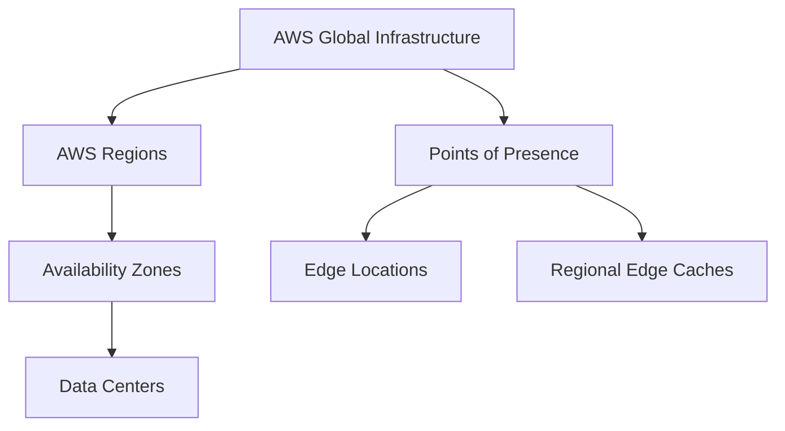

# Module 3: AWS Global Infrastructure Overview

The AWS Global Infrastructure is designed and built to deliver a flexible, reliable, scalable, and secure cloud computing environment with high-quality global network performance. Understanding this layout is essential for designing resilient, high-performance architectures and passing the AWS Certified Cloud Practitioner exam.


## Section 1: AWS Global Infrastructure Components

The AWS Global Infrastructure is structured hierarchically, building outward from physical servers inside data centers to an interconnected planetary network.



### 1. AWS Regions

An **AWS Region** is a physical geographical area across the globe that contains multiple, isolated, and physically separated Availability Zones.

* **Isolation Principle:** Each Region is completely isolated from other Regions to achieve maximum fault tolerance and stability.
* **Data Sovereignty:** Resources and data created in a specific Region **do not automatically replicate** to other Regions. Data replication across Regions is completely controlled and configured by you.
* **Inter-Region Communication:** When communication between Regions occurs, traffic moves over the dedicated, high-speed **AWS backbone network infrastructure** rather than the public internet.

#### Factors for Selecting an AWS Region

Choosing the correct Region is a strategic architectural decision based on four primary pillars:

1. **Data Governance & Legal Requirements:** Compliance and data sovereignty laws (such as the GDPR in the EU) may strictly dictate that specific data types cannot leave regional or national boundaries.
2. **Proximity to Customers (Latency):** Selecting a Region physically closer to your user base minimizes network packet travel distance, significantly lowering latency and improving user experience.
3. **Service Availability:** Not all AWS services or feature updates are immediately deployed to every Region simultaneously. You must ensure your required service portfolio is supported in your target Region.
4. **Cost-Efficiency:** AWS pricing varies by Region due to differing local tax rates, real estate costs, electricity tariffs, and operating expenses.


### 2. Availability Zones (AZs)

An **Availability Zone (AZ)** is one or more discrete, fully isolated data centers housed in separate facilities within an AWS Region.

* **Redundancy & Proximity:** Every AWS Region contains a **minimum of 3 AZs** (some older documentation notes a minimum of 2, but modern standards push for 3+). They are separated by a meaningful physical distance (often miles/kilometers) to insulate against localized disasters like floods, fires, or power grid failures, yet close enough to allow low-latency networking.
* **Interconnection:** AZs are interconnected via high-speed, ultra-low latency **private fiber-optic networking**. This infrastructure enables synchronous data replication across zones.
* **Fault Isolation:** Each AZ operates on its own independent power grid, cooling infrastructure, and network pathing, ensuring a failure in one AZ does not cascade into another.


### 3. AWS Data Centers

AWS Data Centers are the underlying facilities where data physically resides and processing occurs.

* **Scale:** A typical AWS data center houses between **50,000 and 80,000 physical servers**.
* **Custom Equipment:** To achieve extreme efficiency and scale, AWS utilizes custom-designed server racks and networking equipment sourced from multiple **Original Device Manufacturers (ODMs)** to meet precise AWS internal specifications.
* **Security & Non-Disclosure:** Physical locations are highly confidential and never publicly disclosed. Access is restricted by multi-factor authentication, biometric scanners, and strict security guards.
* **Redundant Operations:** Each data center facility features redundant power lines, backup generator setups, and multiple telecommunication carriers.


### 4. Points of Presence (PoPs)

Apart from Regions and AZs, AWS maintains a global footprint of **Points of Presence (PoPs)** to deliver content globally with lower latency. These consist of **Edge Locations** and **Regional Edge Caches**, which power content delivery and edge security services.

* **Edge Locations:** Smaller deployments situated in major metropolitan areas worldwide. They primarily host **Amazon CloudFront** caches to deliver static and dynamic web content, videos, applications, and APIs quickly by caching data closer to the end user.
* **Regional Edge Caches:** Caching layers positioned between Amazon CloudFront Edge Locations and your origin servers. They possess larger storage capacities than individual Edge Locations, allowing them to retain less frequently accessed content longer, preventing costly cache-miss roundtrips back to your origin backend.

> ### 💡 Exam Tip: Traditional IT Mapping to AWS
> 
> 
> When migrating to the cloud, understanding how traditional on-premises infrastructure concepts map directly to AWS global infrastructure components simplifies architectural mapping.
> | On-Premises / Traditional IT | AWS Global Cloud Infrastructure equivalent |
> | --- | --- |
> | **Physical Server Room / Data Center Facility** | Data Center (Component of an AZ) |
> | **Disaster Recovery (DR) Site / Backup Facility** | Separate Availability Zone (AZ) within the Region |
> | **Geographically Dispersed Sub-organizations** | Separate AWS Regions |
> | **Local Content Delivery Appliance / WAN Optimizer** | AWS Points of Presence (Edge Locations) |
> 
> 


## Section 2: Foundational Attributes of Cloud Design

AWS leverages its global infrastructure footprint to provide three core operational characteristics:

* **Elasticity and Scalability:** **Elasticity** refers to the dynamic infrastructure capability to provision and scale down resources automatically in real time to match fluctuating demand. **Scalability** is the architecture's capacity to accommodate long-term data growth and heavy workload expansions without performance degradation.
* **Fault Tolerance:** The systemic capacity to continue operating properly without interruption, even when individual components or entire sub-systems experience a catastrophic hardware or software failure. This relies heavily on built-in component redundancy.
* **High Availability (HA):** Sustaining a high level of operational performance and uptime over a given period while minimizing manual human intervention during disruptions.


## Section 3: AWS Service and Service Category Overview

AWS breaks down its vast portfolio of products into structured service categories. The "AWS Academy Cloud Foundations" course introduces these core categories:

### 1. Compute Services

Services designed to process instructions, run application code, and manage virtual machines or containers.

* **Amazon EC2 (Elastic Compute Cloud):** Provides secure, resizable virtual server capacity (EC2 instances) in the cloud. Gives full OS-level administrative control.
* **AWS Elastic Beanstalk:** A Platform-as-a-Service (PaaS) offering that automates provisioning, load balancing, scaling, and application health monitoring. Developers just upload their code (e.g., Java, .NET, Python).
* **AWS Lambda:** A serverless event-driven compute service that lets you run application code without provisioning or managing any server infrastructure. You are billed strictly for the exact compute execution time utilized.
* **Amazon EKS (Elastic Kubernetes Service):** A fully managed service that simplifies running, deploying, and scaling standardized Kubernetes container workloads on AWS.


### 2. Storage Services

Services optimized for storing data files, system blocks, or file systems with varying access speeds and backup requirements.

* **Amazon S3 (Simple Storage Service):** An object storage service offering industry-leading scalability, data availability, security, and performance. Data is stored as objects inside containers called "buckets."
* **Amazon EBS (Elastic Block Store):** High-performance block-level storage volumes designed explicitly for persistent use with Amazon EC2 instances (analogous to a virtual hard drive).
* **Amazon EFS (Elastic File System):** A serverless, fully managed, elastic network file system (NFS) that can be simultaneously mounted by hundreds of EC2 instances across multiple AZs.


### 3. Database Services

Purpose-built database engines managed by AWS to handle transactional, relational, or non-relational document workloads.

* **Amazon RDS (Relational Database Service):** Simplifies setting up, operating, and scaling a relational database engine (MySQL, PostgreSQL, MariaDB, Oracle, SQL Server) by automating patches, backups, and provisioning.
* **Amazon Aurora:** A cloud-native, enterprise-class relational database engine compatible with MySQL and PostgreSQL. Built to be up to 5 times faster than standard MySQL databases.
* **Amazon DynamoDB:** A fully managed, serverless, single-digit millisecond latency NoSQL document and key-value database designed for massive scale.
* **Amazon Redshift:** A fast, cloud-managed data warehouse service that enables analytical querying across petabytes of structured data using standard SQL.


### 4. Networking and Content Delivery Services

Services engineered to isolate cloud networks, direct incoming user traffic, and route requests safely across the globe.

* **Amazon VPC (Virtual Private Cloud):** Provisions a logically isolated, private virtual network section within the AWS Cloud where you define your own subnets, routing tables, and gateways.
* **Elastic Load Balancing (ELB):** Automatically distributes incoming application traffic across multiple backend targets, such as EC2 instances, containers, or Lambda functions, within multiple AZs.
* **Amazon CloudFront:** A globally distributed Content Delivery Network (CDN) service that securely delivers data, videos, applications, and APIs to users worldwide via Points of Presence.
* **Amazon Route 53:** A highly available and scalable cloud Domain Name System (DNS) web service that translates alphanumeric URLs into numeric IP addresses.
* **AWS Transit Gateway:** Acts as a cloud router, connecting multiple VPCs and on-premises networks to a centralized management gateway.
* **AWS Direct Connect:** Establishes a dedicated, physical, private network circuit from an on-premises data center directly into an AWS facility, bypassing the public internet to reduce network costs and increase bandwidth throughput.
* **AWS VPN (Virtual Private Network):** Establishes secure, encrypted IPsec tunnels between your on-premises network or mobile workers and your private AWS VPC resources over the public internet.


### 5. Security, Identity, and Compliance Services

Services built to validate user permissions, encrypt data at rest or in transit, and evaluate infrastructure compliance.

* **AWS IAM (Identity and Access Management):** Securely manages fine-grained authentication and authorization access control to AWS services and individual resources.
* **AWS Organizations:** Enables central management, consolidated billing, and hierarchical compliance grouping across multiple AWS accounts.
* **Amazon Cognito:** Adds quick user sign-up, sign-in, and granular access control features directly to public web and mobile client applications.
* **AWS Artifact:** An on-demand portal providing immediate self-service access to AWS's official security and compliance reports (e.g., ISO, SOC, PCI reports).
* **AWS KMS (Key Management Service):** A managed service that enables centralized creation, rotation, and cryptographic control of encryption keys across your AWS architecture.
* **AWS Shield:** A managed, always-on Distributed Denial of Service (DDoS) protection service that safeguards applications running on AWS.


### 6. Management and Governance Services

Tools tailored to track configuration history, monitor application metrics, and manage automated resource scaling.

* **AWS Management Console:** A secure, web-based graphical user interface used to configure and administer your AWS accounts and resources.
* **AWS CLI (Command Line Interface):** A unified command-line tool that enables control of AWS services through terminal scripts and automation.
* **AWS Systems Manager:** A management hub to view operational data and automate operational tasks across your AWS resources.
* **AWS Config:** Continuously monitors, records, and audits configuration states of AWS resources to evaluate compliance against desired baselines.
* **Amazon CloudWatch:** A comprehensive monitoring and observability service that tracks metrics, collects log files, and sets automated alarms based on infrastructure performance.
* **AWS Auto Scaling:** Monitors applications and automatically adjusts resources (such as EC2 instances or ECS tasks) to maintain stable, predictable performance at the lowest possible cost.
* **AWS Trusted Advisor:** An online tool that scans your AWS environment to provide real-world optimization recommendations across five core categories: Cost Optimization, Security, Fault Tolerance, Performance, and Service Limits.
* **AWS Well-Architected Tool:** Provides a structured mechanism for reviewing the state of cloud workloads and comparing them against official AWS architectural best practices.
* **AWS CloudTrail:** Tracks governance, compliance, operational auditing, and risk auditing by continuously logging and recording account-wide API calls and user activity history.


### 7. AWS Cost Management Services

Services engineered to visualize billing trends, allocate organizational expenses, and protect budgets.

* **AWS Cost Explorer:** An analytics interface that allows you to visualize, understand, and manage your AWS cost and usage data over time.
* **AWS Budgets:** Allows you to set custom budgets that trigger proactive alerts when your cost or usage exceeds (or is forecasted to exceed) your defined threshold.
* **AWS Cost and Usage Report (CUR):** The most comprehensive dataset for AWS billing metadata, breaking down costs by hours, days, product codes, or custom resource tags.


## Section 4: Architectural Alignment & Shared Responsibility

### The Shared Responsibility Model at the Infrastructure Layer

The foundational concepts of Module 3 connect directly to the **AWS Shared Responsibility Model**.

```
+-------------------------------------------------------------------------+
|                  CUSTOMER RESPONSIBILITY (Security IN the Cloud)         |
|  - Customer Data                                                       |
|  - Guest OS, Network ACLs, Security Group Firewalls                    |
|  - Platform, Applications, IAM User Access Management                   |
+-------------------------------------------------------------------------+
|                    AWS RESPONSIBILITY (Security OF the Cloud)           |
|  - Physical Security of Data Centers                                    |
|  - Hardware, Power, and Cooling Infrastructure                          |
|  - Host OS, Virtualization Software Hypervisor Layer                   |
|  - Global Infrastructure (Regions, AZs, Edge Locations)                |
+-------------------------------------------------------------------------+

```

* **AWS Responsibility (Security OF the Cloud):** AWS owns the physical security, environmental protection, disaster mitigation, hardware cycling, and infrastructure connectivity across all Regions, Availability Zones, and Edge Locations.
* **Customer Responsibility (Security IN the Cloud):** The customer is fully responsible for configuring architectural choices, such as selecting appropriate Regions for data compliance, activating Multi-AZ replication for high availability, managing security groups, and encrypting data stored within those infrastructures.

### Well-Architected Framework Connections

* **Reliability Pillar:** Leverages the Global Infrastructure by building applications across multiple Availability Zones to eliminate single points of failure.
* **Performance Efficiency Pillar:** Solves global latency challenges by using multiple Regions to place applications closer to users and using Edge Locations for content delivery.
