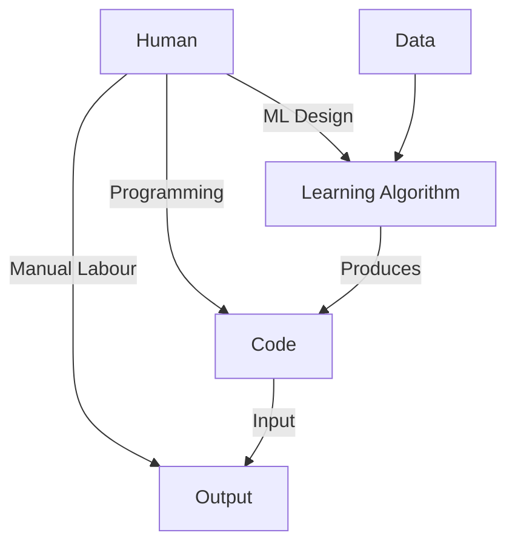

# Week 1: Introduction to Machine Learning

This module introduces the foundational principles of **Machine Learning (ML)**, highlighting the shift from explicit rule-based programming to **data-driven model learning**.

**Learning Objectives**

* Define Machine Learning and position it within the task hierarchy
* Understand core mathematical notation and vector representations
* Distinguish between Supervised and Unsupervised Learning
* Analyze loss functions and parameterized models for Regression
* Understand the roles of Training, Validation, and Test datasets

---

## 1. Defining Machine Learning

**Machine Learning** is the study of computer algorithms that **improve their performance automatically** through experience, typically in the form of data.

### The Task Hierarchy

A **task** is any process that maps an **input** to an **output**. ML represents the highest abstraction of task execution:

| Level                | Method              | Human Role                   | Key Limitation                  |
| -------------------- | ------------------- | ---------------------------- | ------------------------------- |
| **Manual Labour**    | Direct human action | Performs the task directly   | Not scalable                    |
| **Programming**      | Explicit rules      | Writes logic as code         | Infeasible for complex patterns |
| **Machine Learning** | Algorithm design    | Specifies model class + data | Dependent on data quality       |

> **Key Insight**
> In Machine Learning, the human does **not** write the final decision logic. Instead, they design a learning procedure that **constructs the software automatically from data**.

---

## 2. Mathematical Foundations & Notation

Clear notation is essential for deriving and understanding ML algorithms.

### Vector Space and Indexing

* **ℝ**: The set of real numbers
* **ℝᵈ**: A *d-dimensional real vector space*
* **x ∈ ℝᵈ**: A feature vector representing one data point
* **xᵢ**: The *i-th feature* of vector x
* **x⁽ʲ⁾**: The *j-th data point* in a dataset
* **xᵢ⁽ʲ⁾**: The i-th feature of the j-th data point

### Vector Magnitude (ℓ₂ Norm)

The Euclidean (ℓ₂) norm of a vector x is denoted by ‖x‖₂, with:

$$
|x|*2^2 = \sum*{i=1}^{d} x_i^2
$$

This measures the **length** of a vector in ℝᵈ.

---

## 3. Supervised Learning: Curve Fitting

In **supervised learning**, we are given labeled data ((x, y)), and we seek a model (f) such that:

$$
f(x) \approx y
$$

### A. Regression

Regression predicts **continuous** outputs (e.g., house price, temperature).

#### Squared Loss Function

To quantify prediction error, we define a **loss function**. The most common choice for regression is the **Squared Loss**:

$$
\ell(f(x), y) = (f(x) - y)^2
$$

The learning objective is to minimize the **total loss** over the dataset.

#### Linear Parameterization

A common model is linear in its parameters:

$$
f(x) = w^\top x + b
$$

* **w ∈ ℝᵈ**: Weight vector
* **b ∈ ℝ**: Bias (intercept)

> **Important**
> Learning = choosing parameters (w, b) that minimize the total squared loss on the training data.

---

### B. Classification

In **classification**, the output label (y) is **categorical** (e.g., (y ∈ {0,1})).

The model learns a **decision boundary** that separates classes in feature space, rather than predicting exact numeric values.

---

## 4. Unsupervised Learning: Discovering Structure

Unsupervised learning works with inputs (x) **without labels**.

| Task                         | Objective                              | Success Criterion                 |
| ---------------------------- | -------------------------------------- | --------------------------------- |
| **Dimensionality Reduction** | Encode (x ∈ ℝ^d) as (z ∈ ℝ^k), (k < d) | Decoder reconstructs x accurately |
| **Density Estimation**       | Learn probability model (p(x))         | High likelihood on real data      |

### Density Estimation Objective

The loss is typically the **negative log-likelihood**:

$$Loss = \frac{1}{n} \sum_{i=1}^{n} -\log(P(x^i))$$

Minimizing this encourages the model to assign **high probability to observed data**.

---

## 5. Model Selection and Evaluation

To evaluate generalization, data is split into **three disjoint sets**:

1. **Training Set**
   Used to learn model parameters (e.g., (w, b)).

2. **Validation Set**
   Used to select between model classes or hyperparameters.

3. **Test Set**
   Used **once** to report final performance.

> **Caution: Data Leakage**
> Using test data during training or validation leads to overly optimistic performance estimates and invalid conclusions.

---

## Technical Glossary

| Term                        | Definition                                       |
| --------------------------- | ------------------------------------------------ |
| **Feature Vector**          | (x ∈ ℝ^d), numerical representation of an input  |
| **Label (y)**               | Ground-truth output in supervised learning       |
| **Model (f)**               | Function mapping inputs to predictions           |
| **Hyperparameter**          | Defines the model family (not learned from data) |
| **Linear Parameterization** | Model expressed as a weighted sum of features    |

